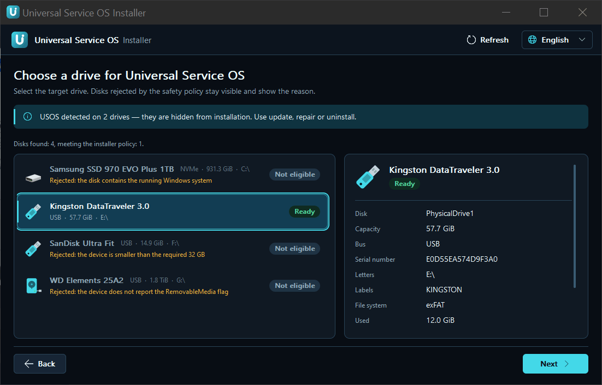
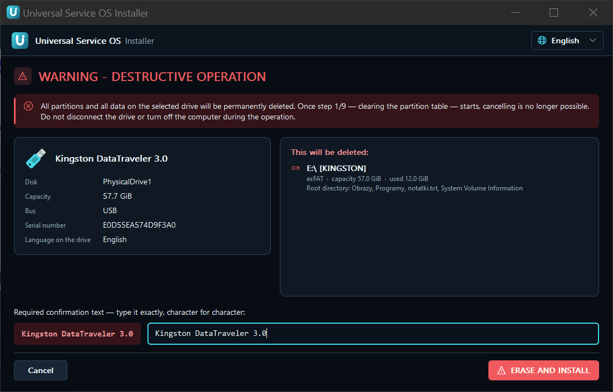
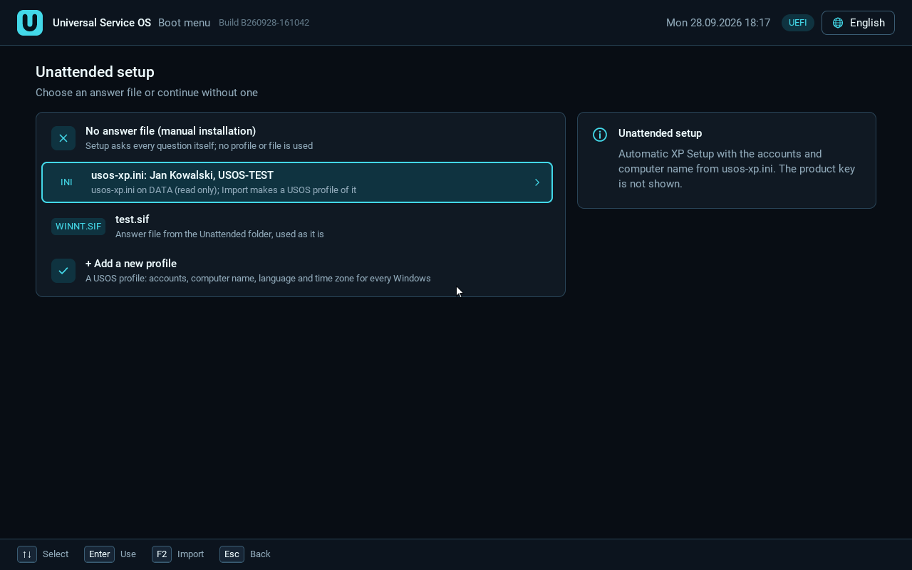
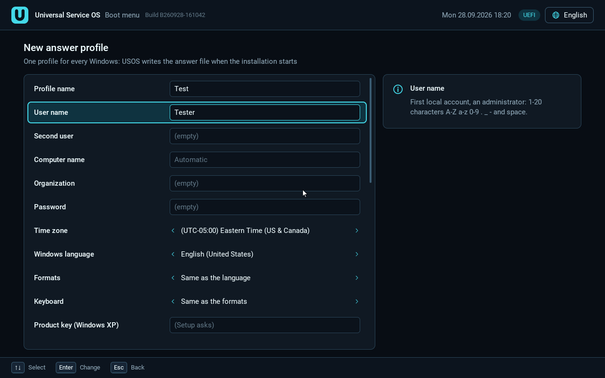
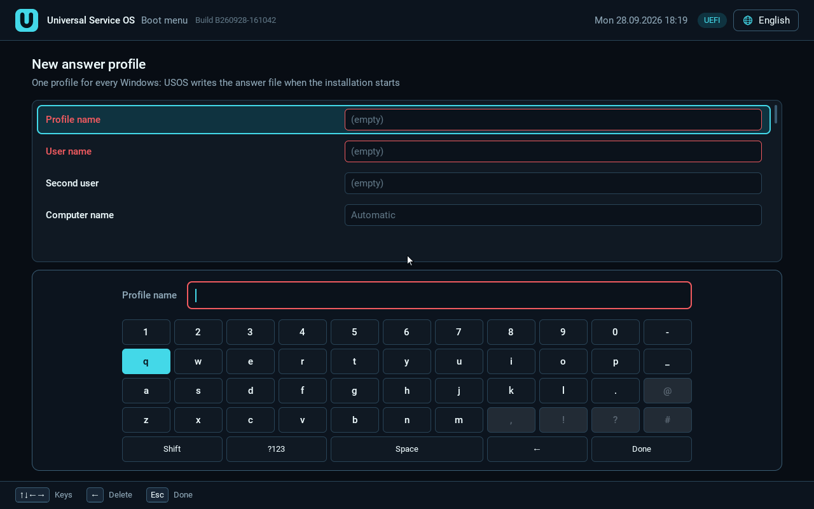
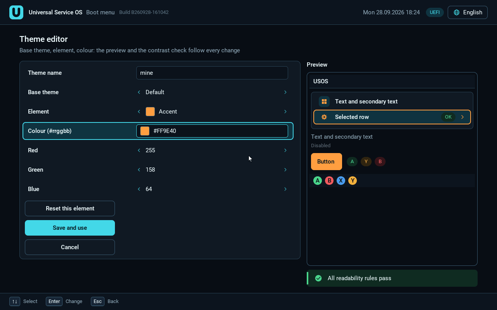

# USOS 1.0: user guide

Version 1.0.0. Wersja polska (primary): [USER-GUIDE.pl.md](USER-GUIDE.pl.md).

This guide is for people who just want to prepare a USB stick and install
systems from it. No programming knowledge is needed.

Contents:

1. [What USOS is and what you need](#1-what-usos-is-and-what-you-need)
2. [The installer: install, update, repair, uninstall](#2-the-installer-install-update-repair-uninstall)
3. [Release files and how to add them](#3-release-files-and-how-to-add-them)
4. [Folder layout on DATA](#4-folder-layout-on-data)
5. [What works in which firmware mode](#5-what-works-in-which-firmware-mode)
6. [Secure Boot and the USOS key (MOK)](#6-secure-boot-and-the-usos-key-mok)
7. [Answer profiles and tweaks](#7-answer-profiles-and-tweaks)
8. [Themes](#8-themes)
9. [Known issues and workarounds](#9-known-issues-and-workarounds)
10. [Not tested yet](#10-not-tested-yet)
11. [Troubleshooting and logs](#11-troubleshooting-and-logs)
12. [Credits](#12-credits)

---

## 1. What USOS is and what you need


**Universal Service OS (USOS)** is one USB stick that installs and starts
systems from MS-DOS to Windows 11 and Linux. It works on old computers
(BIOS) and new ones (UEFI, also with Secure Boot). There is one menu for
everything. You always pick the target disk yourself, and you always have to
confirm it. The USOS stick is never offered as a target disk.

You copy system images (ISO files) to the stick like normal files. USOS
ships no Windows images: you bring your own.

### What you need

- **A USB stick of at least 32 GiB.** The installer rejects smaller
  devices. Note: a stick sold as "32 GB" is usually slightly smaller than
  32 GiB and will be rejected. In practice use a **64 GB or bigger** stick.
  The installer accepts only devices that Windows reports as removable (the
  RemovableMedia flag); some USB SSDs do not, and they will not show as
  "Ready to use".
- **Everything on the stick is erased** during installation. Copy off
  anything you want to keep first.
- **A Windows PC** to run `USOS Installer.exe` on.
- **Administrator rights.** The installer asks for them itself (UAC prompt)
  when you double-click it.

After installation the stick has three partitions:

| Partition | File system | Used for |
|---|---|---|
| USOS_ESP | FAT32, 1 GiB | USOS boot files, Secure Boot key, settings, logs, profiles, themes |
| USOS_DATA | NTFS, the rest | your ISO images, drivers, tools |
| USOS_WORK | NTFS, 1/4 of the stick (12 to 24 GiB) | working space for some Windows installers |

---

## 2. The installer: install, update, repair, uninstall

Start `USOS-Installer-1.0.0.exe` (double-click, accept UAC). The first
screen, "**What do you want to do?**", has four cards:

| Card | What it does | Data |
|---|---|---|
| **Installation** | prepares a new USOS drive | **erases the whole drive** |
| **Local update** | writes the current USOS without formatting | keeps images and your files |
| **Repair** | restores the boot files on the ESP | DATA and WORK unchanged |
| **Uninstall** | removes USOS, leaves one plain exFAT partition | **erases everything** |

At the top of the window you can pick the language. The chosen language is
also written to the stick (boot menu and helper programs). English is always
built in.

### 2.1 Installing onto a new stick




1. Plug in the stick. Unplug other sticks and USB disks so you do not mix
   them up.
2. Start the installer and choose the **Installation** card.
3. In the list "Choose a drive for Universal Service OS" click your stick.
   Disks that must not be used stay visible with the reason (for example
   "the disk contains the running Windows system", "the device is smaller
   than the required 32 GB").
4. Click **Next**. The "**WARNING - DESTRUCTIVE OPERATION**" screen lists
   the partitions and files that will be deleted. Read it.
5. Type the confirmation text shown on the left (the stick's model name)
   exactly, character for character.
6. Click **ERASE AND INSTALL**.
7. Wait. Installation has 9 steps. From step 1 on, it cannot be cancelled.
   **Do not unplug the stick and do not turn off the computer.**
8. At the end the installer reads the stick back and checks the result. The
   final screen has an **Open drivers folder** button (see section 4).

A stick that already has USOS is hidden from the installation list. Use
update, repair or uninstall for it.

### 2.2 Updating an existing stick ("Update USOS")


Use this when you have a newer installer or added files that USOS has to
register (icons, the PE10 donor).

1. Start the new installer and choose the **Local update** card.
2. Pick the stick from the list (only drives with USOS are listed).
3. Check the versions: "On the drive" and "In this installer".
4. Click **Update USOS**.

The update does not format partitions and does not delete system images,
answer files, programs or drivers. It completes the folders and refreshes
the menu catalog. If the stick has a newer version than the installer, the
installer asks whether you really want to downgrade.

### 2.3 Repair ("Repair ESP")

Use this when the stick no longer starts or its boot files are damaged.

1. Choose the **Repair** card and your stick.
2. Click **Repair ESP**.

Repair writes the USOS files on the ESP and the BIOS boot code again. DATA
and WORK are not formatted or cleared.

### 2.4 Uninstall

1. Choose the **Uninstall** card and your stick.
2. Read the "**WARNING - USOS UNINSTALL**" screen. Everything goes: ESP,
   DATA (with your images) and WORK.
3. Type the full device model exactly as shown.
4. Click **START UNINSTALL**.

Result: one plain exFAT partition.

### 2.5 The Secure Boot card in the installer

If the PC running the installer has Secure Boot on and the USOS key is not
on it yet, the installer shows the card "**Secure Boot is on on this
computer**" with the buttons **Prepare (one time)** and **Already done**.
See section 6.

---

## 3. Release files and how to add them

The 1.0 release is a set of separate files:

| File | What it is | Needed |
|---|---|---|
| `USOS-Installer-1.0.0.exe` | the installer (contains all of USOS) | always |
| `USOS-1.0.0-WinPE-PE10-donor.zip` | helper WinPE 10 image ("PE10 donor") | for Vista and original Windows 7 ISOs in UEFI mode |
| `USOS-1.0.0-XP-package-PL.zip` | Windows XP x86 SP3 UEFI package (Polish) | for XP in UEFI mode |
| `USOS-1.0.0-XP-package-EN.zip` | Windows XP x86 SP3 UEFI package (English) | for XP in UEFI mode |
| `USOS-1.0.0-sources.zip` | source code | for reference |
| `LICENSES`, `THIRD-PARTY-NOTICES.txt` | licences | to read |
| `SHA256SUMS` | checksums of all files | to check the download |

**Windows images are never included.** You bring every system ISO yourself.

### 3.1 Checking the checksums (SHA256SUMS)

Do this after downloading, before you run the installer.

One file, in a command prompt (`cmd`):

```
certutil -hashfile USOS-Installer-1.0.0.exe SHA256
```

Or in PowerShell:

```powershell
Get-FileHash .\USOS-Installer-1.0.0.exe -Algorithm SHA256
```

Compare the result with that file's line in `SHA256SUMS`. Upper or lower
case does not matter. Every character must match.

All files at once (PowerShell, in the folder with the downloads):

```powershell
Get-Content .\SHA256SUMS | ForEach-Object {
  $hash, $name = $_ -split '\s+', 2
  $name = $name.TrimStart('*')
  if (Test-Path -LiteralPath $name) {
    $ok = (Get-FileHash -LiteralPath $name -Algorithm SHA256).Hash -eq $hash
    '{0}  {1}' -f $(if ($ok) { 'OK   ' } else { 'BAD  ' }), $name
  }
}
```

If any file shows `BAD`, download it again.

### 3.2 The PE10 donor (Vista and original Windows 7 on UEFI)

Windows Vista and original Windows 7 ISOs need a helper WinPE 10 image in
UEFI mode. Without it the menu blocks these systems on UEFI.

1. Unpack `USOS-1.0.0-WinPE-PE10-donor.zip`. Inside is the folder
   `Programs\USOS\WinPE\` with the file `PE10_x64_19041_USOS.iso`.
2. Copy the `Programs` folder to the **USOS_DATA** partition so that the
   file ends up at `DATA:\Programs\USOS\WinPE\PE10_x64_19041_USOS.iso`.
   `Programs\USOS\WinPE\` may hold only one ISO file.
3. Start the installer and run **Update USOS** (section 2.2). The installer
   then records the image's SHA-256 in `EFI\USOS\winpe-donor.ini` on the ESP
   and marks the folder hidden and system.
4. Do not change, move or delete this file. The menu checks its checksum
   before each use. If the file disappears or changes, the menu blocks Vista
   and Windows 7 on UEFI and asks you to update again in the installer.

This folder never shows up in the systems menu.

### 3.3 The Windows XP package (XP in UEFI mode)

XP in UEFI mode (with and without CSM) needs the XP package on the stick's
ESP. The packages are made for **exactly these two images**:

- Polish: `pl_windows_xp_professional_with_service_pack_3_x86_cd_x14-80476.iso`
- English: `en_windows_xp_professional_with_service_pack_3_x86_cd_x14-80428.iso`

Installing the package:

1. Download the package in the language of your ISO (PL or EN) and unpack it.
2. Plug in the USOS stick. Keep it plugged in until the end.
3. Right-click **PowerShell** and choose "Run as administrator".
4. Go to the unpacked folder and run the included `install-xp-package.ps1`,
   for example:

   ```powershell
   powershell -ExecutionPolicy Bypass -File .\install-xp-package.ps1
   ```

5. The script writes the package to `EFI\USOS-XP` on the stick's ESP.

The stick holds **only one XP package at a time**. Installing a second one
replaces the first. Use the package from the same release as the installer
(the package uses the micro-Linux of that USOS version). After a USOS
update, check that XP is still offered in the UEFI menu; if not, run the
script again with the package that matches the new version.

XP in BIOS (Legacy) mode needs no package, but then there are no extra
drivers and no PAE (section 9).

Copy the XP ISO itself to `Systems\Windows\Windows XP\Images`.

---

## 4. Folder layout on DATA

The installer creates all folders. You only copy files. Images are found
each time you open the menu, so nothing has to run after copying an ISO.
Exception: after adding or changing an `icon.png`, run **Update USOS** to
refresh the icons in the menu.

```
USOS_DATA\
├─ Systems\
│  ├─ README.txt
│  ├─ Windows\
│  │  ├─ Windows 11\        Images\   Unattended\
│  │  ├─ Windows 10\        Images\   Unattended\
│  │  ├─ Windows 8.1\  Windows 8\
│  │  ├─ Windows 7\         Images\   Unattended\
│  │  │   └─ Drivers\x64\   (USB 3 / NVMe drivers for Windows 7)
│  │  ├─ Windows Vista\     Images\   Unattended\
│  │  ├─ Windows XP\        Images\   Unattended\  (usos-xp.ini, usos-xp.example.ini)
│  │  ├─ Windows XP x64\  Windows 2000\  Windows NT 4.0\
│  │  ├─ Windows Me\  Windows 98 SE\  Windows 98\  Windows 95\
│  │  ├─ Windows 3.11\  Windows 3.1\          (Images only)
│  │  └─ Windows Server 2025 ... 2008, Windows Server 2003
│  ├─ Linux\
│  │  ├─ Ubuntu\  Debian\  Fedora\  Linux Mint\  Arch Linux\  openSUSE\
│  │  ├─ Manjaro\  Kali Linux\  SystemRescue\  GParted Live\  Clonezilla\
│  │  └─ Other Linux\       (each: Images\  Unattended\)
│  ├─ Betas\                Whistler, Longhorn, Neptune, Chicago, Memphis, Nashville
│  └─ DOS\
│     ├─ FreeDOS\  MS-DOS\  PC DOS\  DR-DOS\  OpenDOS\  Other DOS\   (Images\)
│     └─ MS-DOS\Programs\   (DOS programs for MS-DOS)
├─ Utilities\
│  ├─ README.txt
│  ├─ FreeDOS\Programs\     (DOS programs for the built-in FreeDOS)
│  ├─ UEFI Shell\Tools\     (EFI tools for the UEFI Shell)
│  └─ <your tool>\Images\   e.g. MemTest86\Images\memtest86.efi
├─ Drivers\
│  ├─ README.txt
│  ├─ UEFI\<Name>\          (.efi drivers for the USOS menu)
│  └─ <Windows version>\    e.g. Windows 11\ with Storage\ USB\ Other\
├─ Themes\<name>\theme.ini  (your own themes, UEFI menu only)
└─ Programs\
   ├─ README.txt
   └─ USOS\                 (managed by USOS, do not touch; holds WinPE\)
```

### 4.1 System images


- Copy the image to the `Images` folder of the right system, e.g.
  `Systems\Windows\Windows 11\Images\`.
- Supported formats: ISO, WIM, IMG, VHD, VHDX, EFI.
- Any file name works.
- Linux images: `Systems\Linux\<distribution>\Images\`. Put an unknown
  distribution with a GRUB entry into `Other Linux\Images\`; the menu marks
  it as unverified.
- Profile icon (optional): `icon.png` next to the `Images` folder, at most
  1 MiB, PNG only.
- If you put a Windows Server image into a client Windows folder (or the
  other way round), the menu tells you the right folder. The image can still
  be started.

### 4.2 Answer files (unattended installation)

- Windows 6.x and newer: `.xml` files in `Systems\Windows\<system>\Unattended\`.
- XP and 2000: `.sif` files and `usos-xp.ini` in `...\Unattended\`
  (section 7.5).
- USOS profiles are made in the UEFI menu and stored on the ESP, not on
  DATA (section 7).

### 4.3 Drivers (`DATA\Drivers`)

This folder is yours. Install and update only create missing folders and
overwrite `README.txt`. Nothing else is deleted.

- **`Drivers\UEFI\<Name>\`**: drivers loaded by the USOS menu (touch,
  input, storage, file systems). A `.efi` file (a driver, not an
  application) and an optional `driver.ini`. With Secure Boot on only signed
  drivers load. The list and on/off switches are in the menu:
  **Utilities -> Drivers**. A driver that hung the menu is blocked
  automatically on the next start.
- **`Drivers\<Windows version>\`**: extracted INF packages (INF + SYS +
  CAT), each package in its own subfolder:
  - `Storage\`: disk controllers (SATA/AHCI, RAID, Intel VMD/RST, NVMe),
    loaded in Windows Setup and added to the installed system;
  - `USB\`: USB 3 controllers, the same way;
  - `Other\`: everything else (network, graphics, chipset), installed
    system only.
- Where this works: Windows 11, 10, 8.1, 8, 7, Server 2008 R2 and newer,
  and (in GUI Setup) Server 2003 x86 and XP x64. The Windows Vista and
  Windows XP folders are prepared but USOS does not use them yet. Windows
  98/Me/95: folder for manual use.
- USOS never bypasses driver signing. A broken package is skipped and
  logged.
- Windows 7 also has its own library:
  `Systems\Windows\Windows 7\Drivers\x64\` (e.g. USB 3 drivers for your
  controller).

### 4.4 Tools


- **Your own bootable tool**: create `Utilities\<Name>\Images\` and put the
  ISO/IMG/EFI there. The folder name is the name in the menu. Run
  **Update USOS** after adding it.
- **DOS programs for FreeDOS** (BIOS only): `Utilities\FreeDOS\Programs\`.
  DOS 8.3 names, no spaces, no non-ASCII characters. Each program may have
  its own subfolder. At least 128 MiB RAM is needed. Output files are gone
  after a restart (RAM disk).
- **EFI tools for the UEFI Shell** (BIOS/VBIOS flashers, GPU testers):
  `Utilities\UEFI Shell\Tools\`. No update is needed after copying. Start
  **Utilities -> UEFI Shell**, then `ls` and the tool's name. DATA is
  read-only in the Shell; a file the tool has to write (e.g. a ROM backup)
  must go to USOS_ESP or a separate FAT32 stick. USOS bundles none of these
  tools.
- **Programs\\**: programs for use after the system is installed (not
  started from the menu).

### 4.5 Themes

Your own themes: `DATA\Themes\<name>\theme.ini` (UEFI menu only) or saved by
the editor on the ESP in `EFI\USOS\themes\<name>.ini` (UEFI and BIOS menus).
Section 8.

---

## 5. What works in which firmware mode


### How to read the table

- **BIOS (Legacy)**: an old BIOS, or a new PC with CSM that started the
  stick in Legacy mode.
- **UEFI with CSM**: the USOS UEFI menu on a PC with CSM enabled.
- **UEFI without CSM**: the USOS UEFI menu on a PC without CSM. For XP,
  Vista, 2000, 2003 and XP x64 USOS then uses CSMWrap (section 9). Windows 7
  without CSM uses another mechanism (UefiSeven with the USOS VGA
  dispatcher).
- **Secure Boot**: the UEFI menu with Secure Boot on (USOS key enrolled).

Labels:

- **HW (machine)**: works, tested on a real computer;
- **QEMU**: works in an emulator (QEMU or VirtualBox), no hardware test;
- **exp.**: experimental, partly tested or never started;
- **no**: does not work or not supported;
- **n/a**: not applicable.

Test machines:

- **X470**: ASRock X470, Ryzen 7 5700X, Radeon RX 560 (UEFI, AMI Aptio);
- **MS-7100**: MSI MS-7100, Socket 939, Athlon 64 X2 (BIOS);
- **Ally**: ASUS ROG Ally RC71L (UEFI, touch screen).

### Table

| System | BIOS (Legacy) | UEFI with CSM | UEFI without CSM | Secure Boot |
|---|---|---|---|---|
| USOS menu | HW (MS-7100) | HW (X470, Ally) | HW (X470) | HW (X470, Ally) |
| MS-DOS 6.22, Windows 3.1 / 3.11 | HW (MS-7100: Windows 3.1 PL in standard mode); the rest QEMU | no | no | no |
| Windows 98 SE | QEMU; on the MS-7100 the install reached the first-boot preparation | no | no | no |
| Windows 2000 SP4 | HW (MS-7100) | exp. (QEMU to file copy) | exp. (QEMU to GUI Setup, CSMWrap) | no |
| Windows XP x86 SP3 | QEMU / VirtualBox | HW (X470: clean install, PAE 31.9 GB) | exp., HW (X470, CSMWrap) | no |
| Windows XP x64 SP2 | not tested | exp. (QEMU to GUI Setup); X470: STOP 0xA5 | exp. (QEMU to GUI Setup) | no |
| Windows Server 2003 x86 SP2 | not tested | exp. (QEMU to GUI Setup); X470: see section 9 | exp. (QEMU to GUI Setup) | no |
| Windows Vista SP2 x64 | HW (MS-7100) | HW (X470) | exp., HW (X470, CSMWrap) | no |
| Windows 7 SP1 x64 | HW (MS-7100) | QEMU (full install) | HW (X470, "6in1" ISO, UefiSeven) | no |
| Windows 8 / 8.1 | exp. (not tested) | exp. (not tested) | exp. (not tested) | not tested |
| Windows 10 | HW (MS-7100, x86 edition) | HW (X470, x64) | native UEFI, CSM not needed; no separate test | QEMU (to the installer start) |
| Windows 11 | not tested | HW (user report, 2026-09-13) | native UEFI, CSM not needed; no separate test | QEMU (to the installer start) |
| Windows Server 2008 - 2025 | exp. (never started) | exp. (never started) | exp. (never started) | 2008 / 2008 R2: no; 2012+: not tested |
| Linux ISOs (Ubuntu, Mint, Fedora, Debian, SystemRescue, GParted, Clonezilla) | QEMU (10 images); HW (MS-7100: Mint desktop) | HW (X470: Mint, Fedora, Debian netinst, SystemRescue, Clonezilla, GParted) | as UEFI with CSM (CSM not needed) | HW (X470: Fedora, Mint); the rest QEMU; SystemRescue: no |
| SliTaz Live | HW (user report) | n/a | n/a | n/a |
| FreeDOS (built in) | HW (user report) | no | no | no |
| Memtest86+ | HW (i586 ISO, user report) | as a `.efi` file in `Utilities` (not tested) | as with CSM | signed `.efi` only |
| Hardware & SMART (built in) | HW (user report; needs an x86-64 CPU) | no | no | no |
| UEFI Shell (built in) | no | QEMU | QEMU | starts, but runs no tools (QEMU) |

Notes on the table:

- "User report" means the user reported the result on their own computer,
  without a detailed test report.
- Windows 7 on UEFI with CSM skips UefiSeven. The X470 test was without CSM
  and used the "6in1" ISO (with a newer WinPE). The original SP1 ISO through
  the PE10 donor was not tested on hardware.
- 32-bit (x86) Windows 10 and 11 are blocked on 64-bit UEFI. Start them in
  BIOS mode (CSM).
- Windows 2000 does not work on the X470: there is no AHCI driver for NT 5.0.
- The menu shows a badge next to each system, e.g. "Requires Secure Boot
  off" or "Requires BIOS".

### 5.1 Legacy BIOS mode (CSMWrap) on PCs without CSM (draft for 1.1)

> Draft: this section describes the 1.1 feature on the branch
> `feature/bios-via-csmwrap`. It is tested in QEMU, not yet on hardware, and
> is not part of 1.0.

On a UEFI computer without CSM (or with CSM switched off), **Utilities ->
Legacy BIOS mode (CSMWrap)** in the UEFI menu starts CSMWrap from the stick.
The computer then works like an old BIOS PC until the next restart and
opens the USOS **BIOS** menu, where FreeDOS, MS-DOS and Windows 3.1 / 3.11
work as on a BIOS machine.

- The entry is shown only when the firmware has no CSM. With a CSM, start
  the stick in Legacy mode instead (the firmware's own BIOS mode).
- **Secure Boot must be off**: CSMWrap is not signed. With Secure Boot on
  the entry is greyed out and says why.
- CSMWrap keeps one CPU thread for itself. DOS and Windows 3.x use one
  thread anyway.
- The graphics card needs a legacy video BIOS (cards that can still boot
  with CSM have one). Without it the DOS screens stay black.
- A restart (also REBOOT in DOS or Ctrl+Alt+Del) always returns to UEFI.

**Installing MS-DOS or Windows 3.x in this mode.** The installer works as
on a BIOS PC. Additionally it puts a small EFI partition (64 MiB, at the end
of the disk) on the target disk, so the installed DOS/Windows disk starts on
its own later: choose the disk's UEFI entry in the firmware boot menu
(Secure Boot off). The confirmation page mentions this. Do not delete the
"Non-DOS" partition in FDISK: without it the disk boots only with a CSM.

On such a disk USOS also sets up:

- the USB mouse in DOS and Windows 3.x (VBADOS VBMOUSE);
- the USB keyboard in Windows 3.x after the final restart, in standard and
  386 enhanced mode and in DOS windows (USOSKEY);
- `HIMEM.SYS /M:2`, which this mode needs.

Windows 3.x Setup runs in batch mode here: after two Enter presses in its
DOS part it installs without questions (user name "USOS", no tutorial, no
printer), so a USB keyboard is enough for the whole installation.

---

## 6. Secure Boot and the USOS key (MOK)

With Secure Boot on, USOS starts through **shim** (signed by Microsoft,
from Fedora) and **its own USOS key**. The key has to be added **once on
each computer**. No password is needed.

With Secure Boot off nothing has to be done: USOS simply starts.

### Way 1 (easiest): add the key with Secure Boot off

1. Enter the BIOS/UEFI setup and turn Secure Boot off. (From Windows: the
   installer's Secure Boot guide has a **Restart into BIOS settings**
   button.)
2. Start the computer from the USOS stick (UEFI mode).
3. The USOS home screen says "USOS cannot find its Secure Boot key on this
   computer. Add it?". Choose **Add**.
4. Confirm the save with **Yes, save the key** (**No** is preselected).
5. After "Key saved" choose **Open BIOS settings** and turn Secure Boot on.
   If the BIOS has no keys, install the default ones ("Install default
   Secure Boot keys" / "Factory keys"), including the Microsoft UEFI CA.

This also works when the BIOS is in Setup Mode (no keys). Confirmed on the
X470. Adding the key **before** turning Secure Boot on means shim's
"Verification failed" screen never appears. You can also add the key later
from the menu: **Utilities -> Secure Boot**.

### Way 2: keep Secure Boot on (MokManager)

1. In the installer click **Prepare (one time)** on the Secure Boot card,
   then **Prepare**. The blue MokManager screen will then wait for you
   instead of counting down 10 seconds. (Optional step.)
2. Start the computer from the stick.
3. On "Verification failed" press Enter once.
4. Choose **Enroll key from disk**.
5. Choose the **USOS_ESP** drive.
6. Choose the file **USOS-KEY.cer**.
7. **Continue** -> **Yes** -> **Reboot**.

On a handheld (e.g. the Ally) tap each button once, do not hold it.
Confirmed on the ROG Ally. The steps are also on the stick:
`EFI\USOS\ENROLL-README.txt`.

If the shim or MokManager text is cut off at the screen edge: turn off
overscan on the monitor ("Just Scan", "1:1", "Screen fit") and "Full Screen
Logo" in the BIOS, or use way 1.

### What removes the key

- Resetting only the Secure Boot keys in the BIOS normally does **not**
  remove the USOS key.
- An NVRAM reset (CMOS clear, some BIOS updates, on some boards "Load UEFI
  defaults") removes it. Add it again then.
- To remove the key on purpose: MokManager -> **Delete MOK**.

### Systems that need Secure Boot off

- Windows XP, Vista and 7 (also Server 2008 and 2008 R2),
- every CSMWrap path (XP, Vista, 2000, 2003, XP x64 without CSM),
- SystemRescue (it has no signed boot loader),
- tools started from the UEFI Shell.

These entries stay visible in the menu with the badge "Requires Secure Boot
off", but starting them is blocked.

Other notes:

- PCs with the "3rd party UEFI CA" turned off (some Secured-core PCs) trust
  no shim at all. Turn that option on in the BIOS.
- After a DBX update (BlackLotus, KB5025885), older Windows media (7/8/10
  and older 11) may not start with Secure Boot on. Use newer media or turn
  Secure Boot off.

---

## 7. Answer profiles and tweaks

A USOS answer profile is one small settings file (accounts, computer name,
language, time zone). When the installation starts, USOS turns it into the
answer file of that system: `WINNT.SIF` for 2000/XP/2003, `autounattend.xml`
for Vista and newer, and for Linux autoinstall (Ubuntu), preseed (Debian) or
kickstart (Fedora).

**You always choose the target disk yourself** in the system's installer.
A profile never selects or wipes a disk.

### 7.1 The profile manager (UEFI menu)






Profiles are made and edited in the UEFI menu only (the Windows installer
has no editor). The "Unattended setup" screen appears after you pick
an image. Rows:

| Row | Enter / A | F2 / X | Del / Y |
|---|---|---|---|
| No answer file (manual installation) | the installer asks everything | | |
| XP: `usos-xp.ini: <user>, <computer>` | hands-off XP | import into a new profile | |
| your USOS profiles | use | edit | delete (after a confirmation) |
| files from the `Unattended\` folder | use as they are | | |
| **+ Add a new profile** | opens the editor | | |

Esc, B or a right click go back. Profiles are stored on the ESP in
`EFI\USOS\profiles\<name>.ini`.

Making a profile, step by step:

1. Pick the system and the ISO image.
2. On the "Unattended setup" screen choose **+ Add a new profile**.
3. Fill in the fields. Use a normal keyboard or the on-screen keyboard
   (handy on the Ally or with a gamepad). A bad value turns the row red and
   the help panel says why.
4. Save. The profile appears in the list. Select it and start the
   installation.

Profiles were confirmed on hardware on the X470 (making a profile and
installing with it).

### 7.2 Profile fields

- profile name, user (administrator), optional second user, computer name,
  organization, password (shown as dots);
- time zone, Windows language, formats, keyboard layout;
- **product key** only for the system the editor was opened from;
- Windows 8 and newer: local account (no online-account screens);
- Windows 11: skip the TPM, Secure Boot and RAM checks, and "set up without
  network";
- Vista and newer: "Protection and updates", "Turn off error reporting";
  Vista/7: network location;
- edition (Vista and newer: pick from the images on the ISO, or "Setup
  asks");
- "Use for": only this system, every Windows, every Linux installer, or
  Windows and Linux;
- the "Appearance and extras" section (7.3).

A profile is shown only for the systems it fits. When something is missing
that makes the installer stop (e.g. a key for 2000/XP/2003, or a password
that meets the Windows Server policy), the profile gets an "Incomplete"
badge and a note in the help panel. The start is not blocked.

### 7.3 Tweaks

All are off by default. The editor shows only the ones that work for that
system. Examples: no games, no MSN, classic Start menu (XP), UAC off
(Vista/7), no sidebar and Welcome Center (Vista), hibernation off, show file
extensions and hidden files, AutoRun off, screen resolution (XP/2003).
Windows 2000 has no tweaks.

### 7.4 Product key

- The key is saved in the file **only** when "Remember the key on this
  stick" is ticked. By default you type it at start and it is kept only until
  the restart.
- USOS ships no keys.
- The password (and a remembered key) are stored on the stick as plain
  text. The menu never shows them in lists or logs.
- USOS does not bypass activation or the product key page.

### 7.5 Files in the `Unattended` folder and `usos-xp.ini`

- `.xml` files (Windows 6.x+) and `.sif` files (XP/2000) from
  `Systems\Windows\<system>\Unattended\` are used as they are. USOS warns
  when a file is for another architecture than the image.
- `Systems\Windows\Windows XP\Unattended\usos-xp.ini`: a simple file for
  hands-off XP. The installer creates it empty (inactive) and on every update
  writes the example `usos-xp.example.ini` with a description. Fill in at
  least `user=`. An existing `usos-xp.ini` is never overwritten.
- A chosen `.sif` file is merged with USOS's automatic answer.
- For Windows 2000 the same file lives in `Windows 2000\Unattended\usos-xp.ini`.

### 7.6 Commands without console windows

On the PE10/WinPE paths (Vista, 7, 10/11, Server) the profile's commands
(e.g. tweaks, the Windows 11 checks) are run by the hidden program
`usos-run-hidden.exe`, so no console windows flash. Command log:
`%WINDIR%\Panther\usos-hidden-commands.log` in the installed system.
This does not cover the BIOS wimboot starts or the WORK preparation for
8/10/11. Still visible: a short (about 1 s) Windows PE console flash right
after PE10 starts, and the "USOS - Vista USB diagnostics" window on Vista's
first start (a USB failure is reported there).

### 7.7 Linux


Profiles work for Ubuntu, Debian and Fedora ISOs in UEFI mode (not BIOS).
The password is written only as a SHA-512 hash. The second user,
organization and keys are ignored. The Ubuntu installer (subiquity) stops at
the disk choice; check which disk is selected (section 9).

---

## 8. Themes




Choose one in **Utilities -> Theme** in the UEFI menu. Enter/A applies it
at once and saves it on the stick.

Built-in themes (UEFI and BIOS):

| Name | Look |
|---|---|
| Default (`default`) | the USOS palette |
| Dark (`dark`) | graphite, blue accent |
| Light (`light`) | dark text on white |
| High contrast (`high-contrast`) | white on black, yellow selection |
| Retro (`retro`) | white and yellow on blue, like a BIOS setup |

Example themes on the stick: `usos-ocean` (navy and cyan), `usos-sunset`
(warm brown and orange), `usos-forest` (light, green). Updates rewrite them;
the editor saves a copy under your own name.

### The theme editor (UEFI)

1. **Utilities -> Theme** -> "Create or edit a theme".
2. Enter a name, pick a base theme and an element.
3. Type a colour `#rrggbb` or change R/G/B with the arrow keys.
4. A live preview is shown beside the form. When the contrast is too low, a
   message appears under the preview and saving is blocked.
5. Choose "Save and use". The theme goes to `EFI\USOS\themes\<name>.ini` on
   the ESP.

The editor was confirmed on the X470.

### Themes in BIOS

The BIOS menu uses the built-in themes and the themes in `EFI\USOS\themes\`
on the ESP (saved by the UEFI editor). In BIOS **only colours** apply, there
is no editor, and the `DATA\Themes` folder is not read.

### Your own `theme.ini`

`DATA\Themes\<name>\theme.ini` (UEFI only):

```
base=dark
accent=#ff9e40
accent_soft=#3a2410
```

An unknown key, a bad colour or too little contrast makes the menu use the
default theme. The reason is shown in **Utilities -> Theme**.

---

## 9. Known issues and workarounds

### Windows Vista

- **Test mode on the X470.** The Vista USB 3 driver is test-signed, so the
  desktop shows "Test Mode". No properly signed xHCI driver exists for the
  X470 on Vista x64. The only way out: a PCIe USB 3 card with a **Renesas
  uPD72020x** chip and its vendor driver.
- **USB flash drives not visible in installed Vista** (boards with only
  USB 3, e.g. the X470). Keyboard and mouse work. Workaround: move files over
  the network, via a second internal SATA disk, an optical drive, or a
  Renesas uPD72020x card.
- Vista has no NVMe driver. Install to a SATA disk.
- Vista without CSM (CSMWrap): the target disk is **wiped completely** and
  gets an MBR layout (up to 2 TiB). The disk is chosen in a separate USOS
  step, and a restart is needed before Vista Setup. After installation,
  remove the stick or pick the disk's UEFI entry in the boot menu.
- On the MS-7100, Vista's automatic restart (BIOS) needed manual help.

### CSMWrap (XP, Vista, 2000, 2003, XP x64 without CSM)

- USOS picks CSMWrap by itself when the firmware has no CSM.
- It needs a graphics card with a **legacy VBIOS** (a CSM-capable option
  ROM). Without one the screen stays black.
- CSMWrap reserves **one CPU core**; the system sees one less.
- A small CSMWrap ESP (64 MiB, at the end of the disk) is created on the
  target disk. It is needed on every start of that system.
- Secure Boot must be off.
- A text cursor blinks in the top-left corner at start, until the system
  changes the screen mode. This is cosmetic.
- On-screen CSMWrap log: create an empty file `EFI\USOS\csmwrap-verbose.flag`
  on the stick.

### Windows XP

- No NVMe (also with CSM). Install to a SATA disk.
- XP in BIOS mode has no driver package and no PAE. Those exist only in the
  UEFI variant (the XP package, section 3.3).
- The XP package works only with the two images in section 3.3.

### Windows Server 2003 and XP x64

- **No USB keyboard and mouse on boards with only USB 3** (e.g. the X470):
  these systems have no xHCI driver. Use a PS/2 keyboard, a board with USB
  2.0 (EHCI), or an answer profile with a key (Server 2003 then reaches the
  desktop without a keyboard). For XP x64 a Renesas uPD720202 card with its
  official driver is recommended (put it in `Drivers\Windows XP x64\USB\`).
- **STOP 0xA5 (ACPI) on the X470.** Both systems stopped on the X470 with
  0xA5 (ACPI_BIOS_ERROR) at the start of text mode: their ACPI driver cannot
  read the tables of newer boards. Server 2003 x86 has since got a
  replacement ACPI driver (the same one XP x86 uses); in QEMU it reaches GUI
  Setup, but the fix has not been tried on the X470 yet. **XP x64 on the
  X470 stays blocked** by 0xA5: USOS cannot ship an x64 ACPI driver, and
  support for a user-supplied replacement is not built yet. "No ACPI" mode
  (F7) is not a real option on these boards.

### Windows 2000

- Does not work on the X470 and similar boards without an IDE mode: Windows
  2000 has no AHCI driver, and the XP driver package does not work on
  NT 5.0.

### Windows 7

- Intel 11th to 14th gen with VMD on: no disk. Turn VMD/RST off.
- Intel Xe/UHD 730/770 and RDNA2 (AM5) graphics have no Windows 7 drivers:
  use a separate graphics card, otherwise you get 800x600.
- Only Windows 7 x64 is supported on UEFI.

### Windows Server

- Windows Server 2012 (not R2) Setup has no NVMe driver. The menu tells you
  to put one in `Drivers\Windows Server 2012\Storage`.

### Linux

- **SystemRescue needs Secure Boot off.**
- **Ubuntu Desktop with Secure Boot on**: in the emulator the installer
  showed an error ("Something went wrong"); not checked on hardware.
- **Ubuntu Server with a profile**: the installer (subiquity) preselects the
  **largest disk**. That may be the USOS stick. Always check the disk before
  you confirm.
- The ISO must be stored in one piece on DATA. If the menu reports a
  fragmented file, copy the ISO again.
- Linux answer profiles work in UEFI only.

### Micro-Linux and old computers

- Many installations (XP, 2000, 2003, Windows 7 in BIOS) are prepared by the
  built-in micro-Linux. It needs an **x86-64** CPU (Athlon 64, Pentium 4
  with EM64T and newer) and **256 MiB RAM**. The BIOS menu itself also runs
  on older 32-bit CPUs.
- Windows 98 and DOS work in BIOS (Legacy) mode only.

### AMI firmware (e.g. ASRock)

- The boot menu shows **every partition of the stick** as its own entry
  "UEFI: <stick>, Partition N". This cannot be removed. The USOS boot file is
  only on the ESP partition (the first one on the stick).

### Secure Boot

- The UEFI Shell starts with Secure Boot on, but **runs no .efi tools**
  (not even signed ones). Turn Secure Boot off, or put a signed tool into
  `Utilities\<Name>\Images\` and start it from the menu.
- Linux and Windows 10/11 with Secure Boot on: see the table in section 5.

---

## 10. Not tested yet

An honest list of what was **not checked on real hardware** in 1.0 (or not
at all):

- Windows 7 SP1 from the original (retail) ISO through the PE10 donor.
- Windows Server 2008, 2008 R2, 2012, 2012 R2, 2016, 2019, 2022, 2025: no
  Server image has been started, neither in an emulator nor on hardware.
- Windows 8 and 8.1.
- Windows 10 and 11 with Secure Boot on, on hardware.
- Windows 11 in BIOS mode.
- Server 2003 with the new ACPI replacement, XP x64 and Windows 2000 on the
  X470.
- XP and Server 2003 / XP x64 in BIOS mode (XP x86 only in virtual machines;
  2003 and XP x64 not at all).
- XP without CSM (CSMWrap): the report on memory (PAE / 31.9 GB), CPU count
  and USB is still pending.
- Linux on hardware: the first X470 round covered Mint, Fedora, Debian
  netinst, SystemRescue, Clonezilla and GParted (Secure Boot off) and Fedora
  and Mint (Secure Boot on). Ubuntu (Server and Desktop) and Debian live were
  not started on hardware. The fixes after that round (no "Verification
  failed" before Mint, correct long file names in the BIOS menu) are not yet
  confirmed on hardware.
- The latest pre-1.0 polish, not yet on hardware:
  - hidden command runner (`usos-run-hidden.exe`),
  - quiet CSMWrap (no logo or SeaBIOS text) on the X470, for XP and Vista,
  - Vista on UEFI with CSM with an answer profile,
  - XP x64 and Server 2003 icons,
  - user themes in the BIOS menu.
- The UEFI Shell on a real computer.
- User drivers from `DATA\Drivers` on a real computer (tested in the
  emulator).

---

## 11. Troubleshooting and logs

### Common situations

| Symptom | What to do |
|---|---|
| The installer does not show the stick as "Ready to use" | Read the rejection reason. Most often: too small (below 32 GiB) or not reported as removable. |
| The installer says "The drive is in use" | Close Explorer windows showing the stick and click Retry. |
| The stick does not start | Run **Repair -> Repair ESP**. |
| Vista / Windows 7 are blocked on UEFI | PE10 donor missing or changed: section 3.2, then **Update USOS**. |
| "Verification failed" at start | The USOS key is missing: section 6. |
| A system has the badge "Requires Secure Boot off" | Turn Secure Boot off in the BIOS. |
| A system has the badge "Requires BIOS" | Start the stick in Legacy mode (turn CSM on). |
| Black screen with XP/Vista without CSM | The graphics card has no legacy VBIOS; turn CSM on or use another card. |
| XP is not offered in the UEFI menu | The XP package is missing: section 3.3. |

### Where the logs are

Logs help when you report a problem. Most of them are on the stick's
**USOS_ESP** partition (Windows shows it as a normal FAT32 drive).

Installer (Windows):

- `USOS Installer.log` next to `USOS Installer.exe`;
- the **Show log** button in the progress window.

On the stick, `USOS_ESP\EFI\USOS\Logs\`:

- `input-devices.txt`: at every start; input devices, screen modes (GOP and
  text) and a `[SECURE BOOT]` section (Secure Boot and key state);
- `drivers.txt`: UEFI drivers from `DATA\Drivers\UEFI`;
- `secure-boot-<UUID>.ini`: the USOS key state for one computer;
- `acpi\<UUID>\`: a copy of that computer's ACPI tables;
- `WinSetup-<time>-<PID>\`: Windows Setup logs from WinPE
  (`usos-startup.log`, `setupact.log`, `setuperr.log`, `setupapi.dev.log`,
  `dism.log`);
- `vista-install.log`: the Vista installer (in the run's folder).

XP, 2000, 2003 and XP x64 preparation:

- from UEFI: `USOS_ESP\EFI\USOS-XP\` (`legacy-xp-*.log`, e.g.
  `legacy-xp-csmwrap.log`, plus `menu-events.log`, `menu-hardware.txt`,
  `legacy-xp-staging-last-error.txt`);
- from BIOS: `USOS_ESP\EFI\USOS\legacy-xp-*.log`.

In the installed system:

- `%WINDIR%\Panther\usos-hidden-commands.log`: profile commands (Vista, 7,
  10/11, Server);
- XP: `C:\USOS\XP\pae-install.log` and `%SystemRoot%\usos-users.log`
  (accounts from `usos-xp.ini`);
- Windows 2000, Server 2003, XP x64: `%SystemRoot%\usos-setup.log`;
- Vista: `<Vista drive>:\USOS\Vista\firstboot-usb.log` (first start, USB);
- Windows 7 without CSM: on the target disk's ESP
  `EFI\Microsoft\Boot\usos-boot-uefiseven.log` and `UefiSeven.log`.

Your own answer files may contain passwords and keys, so they are not copied
into the logs automatically. Before you send logs to anyone, check that they
hold none of your data.

---

## 12. Credits

USOS builds on the work of many open-source projects, among them: shim
(Fedora), the EDK2 UEFI Shell, CSMWrap and SeaBIOS, UefiSeven, wimboot,
EfiFs (NTFS driver), Alpine Linux (micro-Linux), FreeDOS and Doszip,
Patcher9x, wimlib, ImDisk, GenAHCI and TouchI2cDxe. The answer-profile
settings follow the catalogue of Christoph Schneegans' unattend generator
(knowledge only, no code).

USOS itself is free software under the GNU GPL, version 3 or later
(`LICENSE.txt` and `NOTICE.txt` in the release). Full list of the other
components, their licences and sources: the files `THIRD-PARTY-NOTICES.txt`
and `LICENSES` shipped with the release. Licence audit:
[LICENSES-AUDIT.md](LICENSES-AUDIT.md).

Windows, MS-DOS and related names are trademarks of Microsoft. USOS is not
affiliated with Microsoft or with the authors of the projects above.
