# USOS 1.0: przewodnik użytkownika

Wersja 1.0.0. English version: [USER-GUIDE.en.md](USER-GUIDE.en.md).

Ten przewodnik jest dla osób, które chcą po prostu przygotować pendrive
i instalować z niego systemy. Nie trzeba umieć programować.

Spis treści:

1. [Czym jest USOS i co jest potrzebne](#1-czym-jest-usos-i-co-jest-potrzebne)
2. [Instalator: instalacja, aktualizacja, naprawa, deinstalacja](#2-instalator-instalacja-aktualizacja-naprawa-deinstalacja)
3. [Pliki wydania i jak je dodać](#3-pliki-wydania-i-jak-je-dodać)
4. [Układ folderów na DATA](#4-układ-folderów-na-data)
5. [Co działa w którym trybie firmware](#5-co-działa-w-którym-trybie-firmware)
6. [Secure Boot i klucz USOS (MOK)](#6-secure-boot-i-klucz-usos-mok)
7. [Profile odpowiedzi i dodatki](#7-profile-odpowiedzi-i-dodatki)
8. [Motywy](#8-motywy)
9. [Znane problemy i obejścia](#9-znane-problemy-i-obejścia)
10. [Czego jeszcze nie sprawdzono](#10-czego-jeszcze-nie-sprawdzono)
11. [Rozwiązywanie problemów i logi](#11-rozwiązywanie-problemów-i-logi)
12. [Podziękowania](#12-podziękowania)

---

## 1. Czym jest USOS i co jest potrzebne


**Universal Service OS (USOS)** to jeden pendrive, z którego można instalować
i uruchamiać systemy od MS-DOS do Windows 11 oraz Linuksa. Działa na starych
komputerach (BIOS) i nowych (UEFI, także z Secure Boot). Ma jedno menu dla
wszystkiego. Dysk docelowy zawsze wybierasz sam i zawsze musisz to
potwierdzić. Pendrive z USOS nigdy nie jest proponowany jako dysk docelowy.

Obrazy systemów (ISO) kopiujesz na pendrive jak zwykłe pliki. USOS nie
dołącza żadnych obrazów Windows: przynosisz własne.

### Co jest potrzebne

- **Pendrive USB o pojemności co najmniej 32 GiB.** Instalator odrzuca
  mniejsze urządzenia. Uwaga: pendrive opisany na opakowaniu jako „32 GB”
  ma zwykle trochę mniej niż 32 GiB i zostanie odrzucony. W praktyce
  wybierz pendrive **64 GB lub większy**. Instalator przyjmuje tylko
  urządzenia zgłaszane przez Windows jako wymienne (flaga RemovableMedia);
  niektóre dyski USB SSD tego nie robią i nie pojawią się jako „Gotowe”.
- **Cała zawartość pendrive'a zostanie skasowana** przy instalacji.
  Najpierw skopiuj z niego wszystko, co chcesz zachować.
- **Komputer z Windows**, na którym uruchomisz `USOS Installer.exe`.
- **Uprawnienia administratora.** Instalator sam poprosi o nie (okno UAC)
  po dwukrotnym kliknięciu.

Po instalacji pendrive ma trzy partycje:

| Partycja | System plików | Do czego służy |
|---|---|---|
| USOS_ESP | FAT32, 1 GiB | pliki startowe USOS, klucz Secure Boot, ustawienia, logi, profile, motywy |
| USOS_DATA | NTFS, reszta miejsca | Twoje obrazy ISO, sterowniki, narzędzia |
| USOS_WORK | NTFS, 1/4 pendrive'a (12 do 24 GiB) | miejsce robocze dla niektórych instalatorów Windows |

---

## 2. Instalator: instalacja, aktualizacja, naprawa, deinstalacja

Uruchom `USOS-Installer-1.0.0.exe` (dwukrotne kliknięcie, zgoda UAC).
Na pierwszym ekranie „**Co chcesz zrobić?**” są cztery karty:

| Karta | Co robi | Dane |
|---|---|---|
| **Instalacja** | przygotowuje nowy nośnik USOS | **kasuje cały nośnik** |
| **Aktualizacja lokalna** | wgrywa bieżący USOS bez formatowania | zachowuje obrazy i Twoje pliki |
| **Naprawa** | odtwarza pliki startowe na ESP | DATA i WORK bez zmian |
| **Deinstalacja** | usuwa USOS i zostawia jedną partycję exFAT | **kasuje wszystko** |

Na górze okna możesz wybrać język. Wybrany język trafia też na pendrive
(menu startowe i programy pomocnicze). Angielski jest zawsze wbudowany.

### 2.1 Instalacja na nowym pendrivie

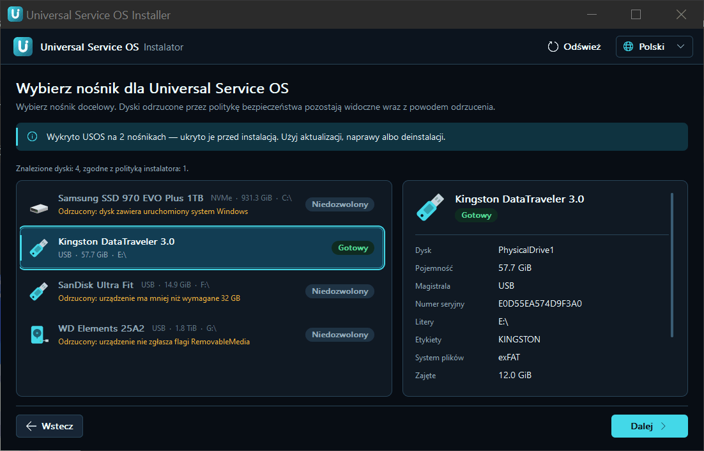
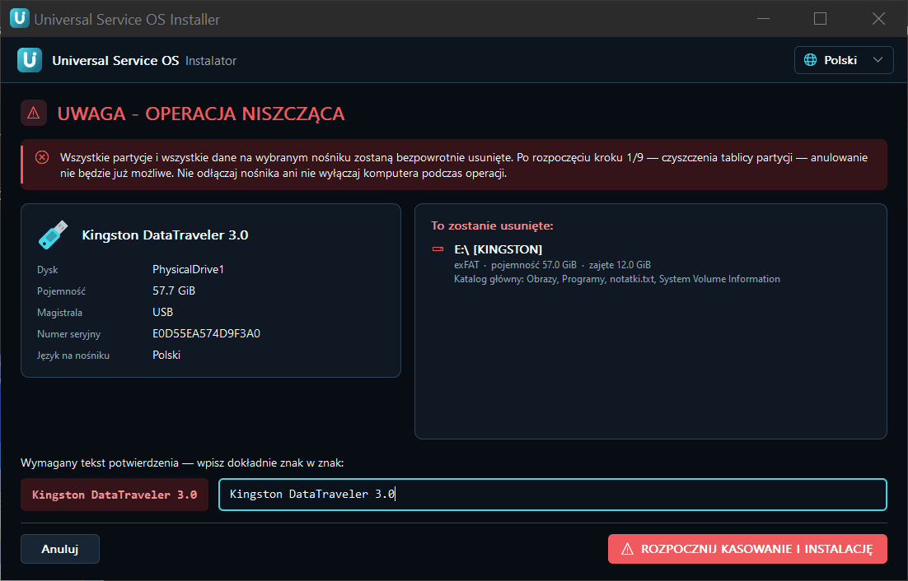

1. Podłącz pendrive. Odłącz inne pendrive'y i dyski USB, żeby się nie
   pomylić.
2. Uruchom instalator i wybierz kartę **Instalacja**.
3. Na liście „Wybierz nośnik dla Universal Service OS” kliknij swój
   pendrive. Dyski, których nie wolno użyć, są widoczne z powodem odrzucenia
   (np. „dysk zawiera uruchomiony system Windows”, „urządzenie ma mniej niż
   wymagane 32 GB”).
4. Kliknij **Dalej**. Pojawi się ekran „**UWAGA - OPERACJA NISZCZĄCA**”
   z listą partycji i plików, które zostaną usunięte. Przeczytaj ją.
5. Wpisz dokładnie, znak w znak, tekst potwierdzenia pokazany po lewej
   (nazwę modelu pendrive'a).
6. Kliknij **ROZPOCZNIJ KASOWANIE I INSTALACJĘ**.
7. Czekaj. Instalacja ma 9 kroków. Od kroku 1 nie da się już przerwać.
   **Nie odłączaj pendrive'a i nie wyłączaj komputera.**
8. Na końcu instalator sam czyta pendrive i sprawdza wynik. Ekran końcowy
   ma przycisk **Otwórz folder sterowników** (patrz rozdział 4).

Pendrive, na którym USOS już jest, jest ukryty na liście instalacji.
Dla niego używaj aktualizacji, naprawy albo deinstalacji.

### 2.2 Aktualizacja istniejącego pendrive'a („Aktualizuj USOS”)


Użyj tego, gdy masz nowszy instalator albo dodałeś pliki, które USOS musi
zarejestrować (ikony, dawca PE10).

1. Uruchom nowy instalator i wybierz kartę **Aktualizacja lokalna**.
2. Wybierz pendrive z listy (są na niej tylko nośniki z USOS).
3. Sprawdź wersje: „Na nośniku” i „W tym instalatorze”.
4. Kliknij **Aktualizuj USOS**.

Aktualizacja nie formatuje partycji i nie usuwa obrazów systemów, plików
odpowiedzi, programów ani sterowników. Uzupełnia foldery i odświeża katalog
menu. Jeśli pendrive ma nowszą wersję niż instalator, instalator zapyta,
czy na pewno chcesz wgrać starszą.

### 2.3 Naprawa („Napraw ESP”)

Użyj, gdy pendrive przestał się uruchamiać albo pliki startowe są uszkodzone.

1. Wybierz kartę **Naprawa** i swój pendrive.
2. Kliknij **Napraw ESP**.

Naprawa zapisuje od nowa pliki USOS na ESP oraz kod startowy dla trybu BIOS.
DATA i WORK nie są formatowane ani czyszczone.

### 2.4 Deinstalacja

1. Wybierz kartę **Deinstalacja** i swój pendrive.
2. Przeczytaj ekran „**UWAGA - DEINSTALACJA USOS**”. Zniknie wszystko:
   ESP, DATA (z obrazami) i WORK.
3. Wpisz pełny model urządzenia dokładnie tak, jak jest pokazany.
4. Kliknij **ROZPOCZNIJ DEINSTALACJĘ**.

Wynik: jedna zwykła partycja exFAT.

### 2.5 Karta Secure Boot w instalatorze

Jeśli komputer, na którym uruchomiłeś instalator, ma włączony Secure Boot
i nie ma jeszcze klucza USOS, instalator pokaże kartę „**Ten komputer ma
włączony Secure Boot**” z przyciskami **Przygotuj (jednorazowo)** i **Już
zrobione**. Opis w rozdziale 6.

---

## 3. Pliki wydania i jak je dodać

Wydanie 1.0 to kilka osobnych plików:

| Plik | Co to jest | Czy potrzebny |
|---|---|---|
| `USOS-Installer-1.0.0.exe` | instalator (zawiera cały USOS) | zawsze |
| `USOS-1.0.0-WinPE-PE10-donor.zip` | pomocniczy obraz WinPE 10 („dawca PE10”) | dla Visty i oryginalnych ISO Windows 7 w trybie UEFI |
| `USOS-1.0.0-XP-package-PL.zip` | pakiet Windows XP x86 SP3 dla UEFI (polski) | dla XP w trybie UEFI |
| `USOS-1.0.0-XP-package-EN.zip` | pakiet Windows XP x86 SP3 dla UEFI (angielski) | dla XP w trybie UEFI |
| `USOS-1.0.0-sources.zip` | kod źródłowy | nie do używania, do wglądu |
| `LICENSES`, `THIRD-PARTY-NOTICES.txt` | licencje | do przeczytania |
| `SHA256SUMS` | sumy kontrolne wszystkich plików | do sprawdzenia pobrania |

**Obrazy Windows nigdy nie są dołączone.** Każdy obraz ISO systemu
przynosisz sam.

### 3.1 Sprawdzenie sum kontrolnych (SHA256SUMS)

Zrób to po pobraniu, zanim uruchomisz instalator.

Jeden plik, w wierszu poleceń (`cmd`):

```
certutil -hashfile USOS-Installer-1.0.0.exe SHA256
```

Albo w PowerShell:

```powershell
Get-FileHash .\USOS-Installer-1.0.0.exe -Algorithm SHA256
```

Porównaj wynik z wierszem tego pliku w `SHA256SUMS`. Wielkość liter nie ma
znaczenia. Muszą się zgadzać wszystkie znaki.

Wszystkie pliki naraz (PowerShell, w folderze z pobranymi plikami):

```powershell
Get-Content .\SHA256SUMS | ForEach-Object {
  $hash, $name = $_ -split '\s+', 2
  $name = $name.TrimStart('*')
  if (Test-Path -LiteralPath $name) {
    $ok = (Get-FileHash -LiteralPath $name -Algorithm SHA256).Hash -eq $hash
    '{0}  {1}' -f $(if ($ok) { 'OK   ' } else { 'BLAD ' }), $name
  }
}
```

Jeśli przy którymkolwiek pliku jest `BLAD`, pobierz go ponownie.

### 3.2 Dawca PE10 (Vista i oryginalny Windows 7 w UEFI)

Windows Vista oraz oryginalne ISO Windows 7 potrzebują w trybie UEFI
pomocniczego obrazu WinPE 10. Bez niego menu zablokuje te systemy w UEFI.

1. Rozpakuj `USOS-1.0.0-WinPE-PE10-donor.zip`. W środku jest folder
   `Programs\USOS\WinPE\` z plikiem `PE10_x64_19041_USOS.iso`.
2. Skopiuj folder `Programs` na partycję **USOS_DATA** tak, żeby plik
   leżał w `DATA:\Programs\USOS\WinPE\PE10_x64_19041_USOS.iso`.
   W `Programs\USOS\WinPE\` może być tylko jeden plik ISO.
3. Uruchom instalator i wykonaj **Aktualizuj USOS** (rozdział 2.2).
   Instalator zapisze wtedy sumę SHA-256 obrazu w `EFI\USOS\winpe-donor.ini`
   na ESP i oznaczy folder jako ukryty i systemowy.
4. Nie zmieniaj, nie przenoś i nie usuwaj tego pliku. Menu sprawdza jego sumę
   przed każdym użyciem. Jeśli plik zniknie albo się zmieni, menu zablokuje
   Vistę i Windows 7 w UEFI i poprosi o ponowną aktualizację w instalatorze.

Ten folder nie pojawia się w menu systemów.

### 3.3 Pakiet Windows XP (XP w trybie UEFI)

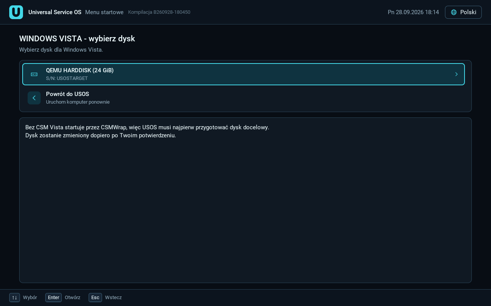
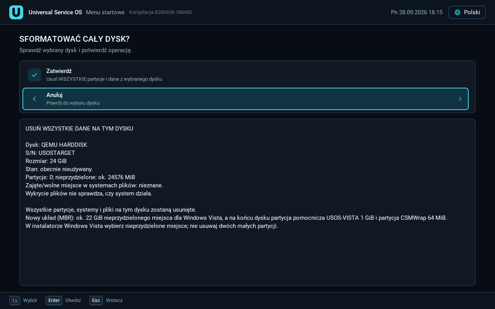

XP w trybie UEFI (z CSM i bez CSM) potrzebuje pakietu XP na ESP pendrive'a.
Pakiety są zrobione dla **dokładnie tych dwóch obrazów**:

- polski: `pl_windows_xp_professional_with_service_pack_3_x86_cd_x14-80476.iso`
- angielski: `en_windows_xp_professional_with_service_pack_3_x86_cd_x14-80428.iso`

Instalacja pakietu:

1. Pobierz pakiet w języku Twojego ISO (PL albo EN) i rozpakuj go.
2. Podłącz pendrive z USOS. Nie odłączaj go do końca.
3. Kliknij prawym przyciskiem **PowerShell** i wybierz „Uruchom jako
   administrator”.
4. Przejdź do rozpakowanego folderu i uruchom dołączony skrypt
   `install-xp-package.ps1`, np.:

   ```powershell
   powershell -ExecutionPolicy Bypass -File .\install-xp-package.ps1
   ```

5. Skrypt zapisze pakiet do `EFI\USOS-XP` na ESP pendrive'a.

Na pendrivie może być **tylko jeden pakiet XP naraz**. Instalacja drugiego
zastępuje pierwszy. Używaj pakietu z tego samego wydania co instalator
(pakiet korzysta z mikro-Linuksa USOS danej wersji). Po aktualizacji USOS
sprawdź, czy XP nadal jest dostępny w menu UEFI; jeśli nie, uruchom skrypt
ponownie z pakietem pasującym do nowej wersji.

XP w trybie BIOS (Legacy) nie wymaga pakietu, ale wtedy nie ma dodatkowych
sterowników ani PAE (rozdział 9).

Obraz ISO XP kopiujesz osobno do `Systems\Windows\Windows XP\Images`.

---

## 4. Układ folderów na DATA

Instalator tworzy wszystkie foldery sam. Ty tylko kopiujesz pliki. Obrazy
są wykrywane przy każdym wejściu do menu, więc po skopiowaniu ISO nie
trzeba niczego uruchamiać. Wyjątek: po dodaniu lub zmianie `icon.png`
uruchom **Aktualizuj USOS**, żeby odświeżyć ikony w menu.

```
USOS_DATA\
├─ Systems\
│  ├─ README.txt
│  ├─ Windows\
│  │  ├─ Windows 11\        Images\   Unattended\
│  │  ├─ Windows 10\        Images\   Unattended\
│  │  ├─ Windows 8.1\  Windows 8\
│  │  ├─ Windows 7\         Images\   Unattended\
│  │  │   └─ Drivers\x64\   (sterowniki USB 3 / NVMe dla Windows 7)
│  │  ├─ Windows Vista\     Images\   Unattended\
│  │  ├─ Windows XP\        Images\   Unattended\  (usos-xp.ini, usos-xp.example.ini)
│  │  ├─ Windows XP x64\  Windows 2000\  Windows NT 4.0\
│  │  ├─ Windows Me\  Windows 98 SE\  Windows 98\  Windows 95\
│  │  ├─ Windows 3.11\  Windows 3.1\          (tylko Images)
│  │  └─ Windows Server 2025 ... 2008, Windows Server 2003
│  ├─ Linux\
│  │  ├─ Ubuntu\  Debian\  Fedora\  Linux Mint\  Arch Linux\  openSUSE\
│  │  ├─ Manjaro\  Kali Linux\  SystemRescue\  GParted Live\  Clonezilla\
│  │  └─ Other Linux\       (każdy: Images\  Unattended\)
│  ├─ Betas\                Whistler, Longhorn, Neptune, Chicago, Memphis, Nashville
│  └─ DOS\
│     ├─ FreeDOS\  MS-DOS\  PC DOS\  DR-DOS\  OpenDOS\  Other DOS\   (Images\)
│     └─ MS-DOS\Programs\   (programy DOS dla MS-DOS)
├─ Utilities\
│  ├─ README.txt
│  ├─ FreeDOS\Programs\     (programy DOS dla wbudowanego FreeDOS)
│  ├─ UEFI Shell\Tools\     (narzędzia EFI dla powłoki UEFI)
│  └─ <Twoje narzędzie>\Images\   np. MemTest86\Images\memtest86.efi
├─ Drivers\
│  ├─ README.txt
│  ├─ UEFI\<Nazwa>\         (sterowniki .efi dla menu USOS)
│  └─ <wersja Windows>\     np. Windows 11\ z podfolderami Storage\ USB\ Other\
├─ Themes\<nazwa>\theme.ini (własne motywy, tylko menu UEFI)
└─ Programs\
   ├─ README.txt
   └─ USOS\                 (zarządzany przez USOS, nie ruszaj; tu jest WinPE\)
```

### 4.1 Obrazy systemów


- Kopiuj obraz do folderu `Images` właściwego systemu, np.
  `Systems\Windows\Windows 11\Images\`.
- Obsługiwane formaty: ISO, WIM, IMG, VHD, VHDX, EFI.
- Nazwa pliku jest dowolna.
- Obrazy Linuksa: `Systems\Linux\<dystrybucja>\Images\`. Nieznaną
  dystrybucję z wpisem GRUB włóż do `Other Linux\Images\`; menu oznaczy ją
  jako niezweryfikowaną.
- Ikona profilu (opcjonalnie): `icon.png` obok folderu `Images`, najwyżej
  1 MiB, tylko PNG.
- Jeśli wrzucisz obraz Windows Server do folderu zwykłego Windows (albo
  odwrotnie), menu podpowie właściwy folder. Obraz i tak da się uruchomić.

### 4.2 Pliki odpowiedzi (instalacja nienadzorowana)

- Windows 6.x i nowsze: pliki `.xml` w `Systems\Windows\<system>\Unattended\`.
- XP i 2000: pliki `.sif` oraz `usos-xp.ini` w `...\Unattended\`
  (rozdział 7.5).
- Profile USOS robisz w menu UEFI; są zapisywane na ESP, nie na DATA
  (rozdział 7).

### 4.3 Sterowniki (`DATA\Drivers`)

Ten folder należy do Ciebie. Instalacja i aktualizacja tworzą tylko
brakujące foldery i nadpisują `README.txt`. Nic innego nie jest usuwane.

- **`Drivers\UEFI\<Nazwa>\`**: sterowniki uruchamiane w menu USOS (dotyk,
  wejście, dyski, systemy plików). Plik `.efi` (sterownik, nie aplikacja)
  i opcjonalny `driver.ini`. Przy włączonym Secure Boot ładują się tylko
  sterowniki podpisane. Listę i przełączniki znajdziesz w menu:
  **Narzędzia -> Sterowniki**. Sterownik, który zawiesił menu, jest przy
  następnym starcie automatycznie blokowany.
- **`Drivers\<wersja Windows>\`**: rozpakowane pakiety INF (INF + SYS +
  CAT), każdy pakiet w osobnym podfolderze:
  - `Storage\`: kontrolery dysków (SATA/AHCI, RAID, Intel VMD/RST, NVMe),
    ładowane w Instalatorze Windows i dodawane do systemu;
  - `USB\`: kontrolery USB 3, tak samo;
  - `Other\`: reszta (sieć, grafika, chipset), tylko do zainstalowanego
    systemu.
- Gdzie to działa: Windows 11, 10, 8.1, 8, 7, Server 2008 R2 i nowsze oraz
  (w trybie GUI Setup) Server 2003 x86 i XP x64. Foldery Windows Vista
  i Windows XP są przygotowane, ale USOS ich jeszcze nie używa. Windows
  98/Me/95: folder do ręcznego użycia.
- USOS nigdy nie omija podpisu sterowników. Uszkodzony pakiet jest pomijany
  i zapisany w logu.
- Windows 7 ma też własną bibliotekę:
  `Systems\Windows\Windows 7\Drivers\x64\` (np. sterowniki USB 3 danego
  kontrolera).

### 4.4 Narzędzia

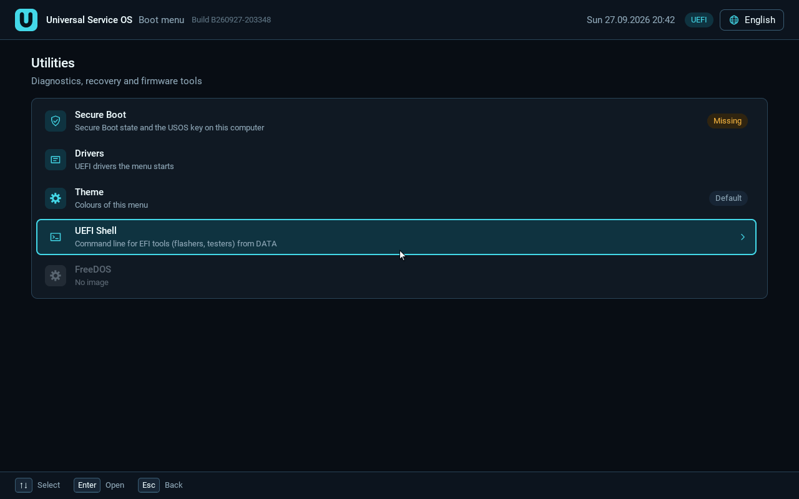
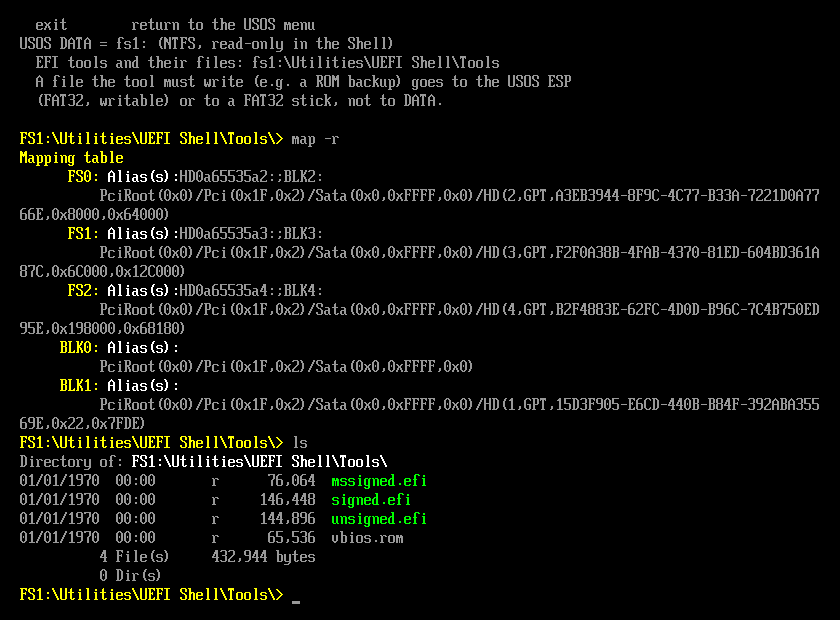

- **Własne narzędzie bootowalne**: utwórz `Utilities\<Nazwa>\Images\`
  i włóż tam ISO/IMG/EFI. Nazwa folderu to nazwa w menu. Po dodaniu
  uruchom **Aktualizuj USOS**.
- **Programy DOS dla FreeDOS** (tylko BIOS): `Utilities\FreeDOS\Programs\`.
  Nazwy DOS 8.3, bez spacji i polskich znaków. Każdy program może mieć
  swój podfolder. Wymagane co najmniej 128 MiB RAM. Pliki wynikowe znikają
  po restarcie (dysk RAM).
- **Narzędzia EFI dla powłoki UEFI** (flashery BIOS/VBIOS, testery GPU):
  `Utilities\UEFI Shell\Tools\`. Po skopiowaniu nie trzeba aktualizacji.
  Uruchom: **Narzędzia -> Powłoka UEFI**, potem `ls` i nazwę narzędzia.
  DATA jest w powłoce tylko do odczytu; plik do zapisania (np. kopię ROM)
  zapisz na USOS_ESP albo na osobnym pendrivie FAT32. USOS nie dołącza
  żadnego z tych narzędzi.
- **Programs\\**: programy do użycia już po instalacji systemu (nie są
  uruchamiane z menu).

### 4.5 Motywy

Własne motywy: `DATA\Themes\<nazwa>\theme.ini` (tylko menu UEFI) albo
zapisane edytorem na ESP w `EFI\USOS\themes\<nazwa>.ini` (menu UEFI
i BIOS). Rozdział 8.

---

## 5. Co działa w którym trybie firmware


### Jak czytać tabelę

- **BIOS (Legacy)**: stary BIOS albo nowy komputer z CSM, który uruchomił
  pendrive w trybie Legacy.
- **UEFI z CSM**: menu UEFI USOS na komputerze z włączonym CSM.
- **UEFI bez CSM**: menu UEFI USOS na komputerze bez CSM. Dla XP, Visty,
  2000, 2003 i XP x64 USOS używa wtedy CSMWrap (rozdział 9). Windows 7
  bez CSM używa innego mechanizmu (UefiSeven z dyspozytorem VGA USOS).
- **Secure Boot**: menu UEFI przy włączonym Secure Boot (klucz USOS
  dodany).

Oznaczenia:

- **SPRZĘT (maszyna)**: działa, sprawdzone na prawdziwym komputerze;
- **QEMU**: działa w emulatorze (QEMU lub VirtualBox), bez testu na sprzęcie;
- **eksp.**: eksperymentalne, częściowo sprawdzone albo nieuruchamiane;
- **nie**: nie działa albo nieobsługiwane;
- **n/d**: nie dotyczy.

Maszyny testowe:

- **X470**: ASRock X470, Ryzen 7 5700X, Radeon RX 560 (UEFI, AMI Aptio);
- **MS-7100**: MSI MS-7100, Socket 939, Athlon 64 X2 (BIOS);
- **Ally**: ASUS ROG Ally RC71L (UEFI, ekran dotykowy).

### Tabela

| System | BIOS (Legacy) | UEFI z CSM | UEFI bez CSM | Secure Boot |
|---|---|---|---|---|
| Menu USOS | SPRZĘT (MS-7100) | SPRZĘT (X470, Ally) | SPRZĘT (X470) | SPRZĘT (X470, Ally) |
| MS-DOS 6.22, Windows 3.1 / 3.11 | SPRZĘT (MS-7100: Windows 3.1 PL w trybie standardowym); reszta QEMU | nie | nie | nie |
| Windows 98 SE | QEMU; na MS-7100 instalacja doszła do przygotowania pierwszego startu | nie | nie | nie |
| Windows 2000 SP4 | SPRZĘT (MS-7100) | eksp. (QEMU do kopiowania plików) | eksp. (QEMU do GUI Setup, CSMWrap) | nie |
| Windows XP x86 SP3 | QEMU / VirtualBox | SPRZĘT (X470: czysta instalacja, PAE 31,9 GB) | eksp., SPRZĘT (X470, CSMWrap) | nie |
| Windows XP x64 SP2 | nie testowano | eksp. (QEMU do GUI Setup); X470: STOP 0xA5 | eksp. (QEMU do GUI Setup) | nie |
| Windows Server 2003 x86 SP2 | nie testowano | eksp. (QEMU do GUI Setup); X470: patrz rozdział 9 | eksp. (QEMU do GUI Setup) | nie |
| Windows Vista SP2 x64 | SPRZĘT (MS-7100) | SPRZĘT (X470) | eksp., SPRZĘT (X470, CSMWrap) | nie |
| Windows 7 SP1 x64 | SPRZĘT (MS-7100) | QEMU (pełna instalacja) | SPRZĘT (X470, ISO „6in1”, UefiSeven) | nie |
| Windows 8 / 8.1 | eksp. (nie testowano) | eksp. (nie testowano) | eksp. (nie testowano) | nie testowano |
| Windows 10 | SPRZĘT (MS-7100, wersja x86) | SPRZĘT (X470, x64) | natywny UEFI, CSM niepotrzebny; bez osobnego testu | QEMU (do startu instalatora) |
| Windows 11 | nie testowano | SPRZĘT (zgłoszenie użytkownika, 13.09.2026) | natywny UEFI, CSM niepotrzebny; bez osobnego testu | QEMU (do startu instalatora) |
| Windows Server 2008 - 2025 | eksp. (nieuruchamiane) | eksp. (nieuruchamiane) | eksp. (nieuruchamiane) | 2008 / 2008 R2: nie; 2012+: nie testowano |
| Linux z ISO (Ubuntu, Mint, Fedora, Debian, SystemRescue, GParted, Clonezilla) | QEMU (10 obrazów); SPRZĘT (MS-7100: pulpit Mint) | SPRZĘT (X470: Mint, Fedora, Debian netinst, SystemRescue, Clonezilla, GParted) | jak UEFI z CSM (CSM niepotrzebny) | SPRZĘT (X470: Fedora, Mint); reszta QEMU; SystemRescue: nie |
| SliTaz Live | SPRZĘT (zgłoszenie użytkownika) | n/d | n/d | n/d |
| FreeDOS (wbudowany) | SPRZĘT (zgłoszenie użytkownika) | nie | nie | nie |
| Memtest86+ | SPRZĘT (wersja i586 ISO, zgłoszenie użytkownika) | jako plik `.efi` w `Utilities` (nie testowano) | jak z CSM | tylko podpisany plik `.efi` |
| Hardware & SMART (wbudowany) | SPRZĘT (zgłoszenie użytkownika; wymaga CPU x86-64) | nie | nie | nie |
| Powłoka UEFI (wbudowana) | nie | QEMU | QEMU | startuje, ale nie uruchamia narzędzi (QEMU) |

Uwagi do tabeli:

- „Zgłoszenie użytkownika” znaczy, że wynik zgłosił użytkownik na swoim
  komputerze, bez szczegółowego raportu.
- Windows 7 z CSM w UEFI omija UefiSeven. Test na X470 dotyczył trybu bez
  CSM i obrazu „6in1” (z nowszym WinPE). Oryginalne ISO SP1 przez dawcę PE10
  nie było testowane na sprzęcie.
- Windows 10 i 11 w wersji x86 (32-bit) są zablokowane na 64-bitowym UEFI.
  Uruchom je w trybie BIOS (CSM).
- Windows 2000 na X470 nie działa: brak sterownika AHCI dla NT 5.0.
- Menu przy każdym systemie pokazuje odznakę, np. „Wymaga wyłączenia
  Secure Boot” albo „Wymaga BIOS”.

---

## 6. Secure Boot i klucz USOS (MOK)

USOS startuje przy włączonym Secure Boot przez **shim** (podpisany przez
Microsoft, z Fedory) i **własny klucz USOS**. Klucz trzeba dodać **raz na
każdym komputerze**. Nie trzeba hasła.

Przy wyłączonym Secure Boot nic nie trzeba robić: USOS po prostu startuje.

### Sposób 1 (najprostszy): dodanie klucza przy wyłączonym Secure Boot

1. Wejdź do ustawień BIOS/UEFI i wyłącz Secure Boot. (Z Windows: w
   instalatorze w przewodniku Secure Boot jest przycisk **Uruchom ponownie
   do ustawień BIOS**.)
2. Uruchom komputer z pendrive'a USOS (tryb UEFI).
3. Na ekranie głównym USOS pojawi się: „Nie wykryto klucza Secure Boot
   potrzebnego do uruchamiania USOS. Dodać go?”. Wybierz **Dodaj**.
4. Potwierdź zapis (**Tak, zapisz klucz**; domyślnie zaznaczone jest „Nie”).
5. Po komunikacie „Klucz zapisany” wybierz **Otwórz ustawienia BIOS**
   i włącz Secure Boot. Jeśli BIOS nie ma kluczy, zainstaluj domyślne
   („Install default Secure Boot keys” / „Factory keys”), z kluczem
   Microsoft UEFI CA.

To działa także, gdy BIOS jest w trybie Setup Mode (bez kluczy).
Sprawdzone na X470. Dodanie klucza **przed** włączeniem Secure Boot
sprawia, że ekran shim „Verification failed” w ogóle się nie pojawia.
Później klucz dodasz też z menu: **Narzędzia -> Secure Boot**.

### Sposób 2: Secure Boot zostaje włączony (MokManager)

1. W instalatorze kliknij **Przygotuj (jednorazowo)** na karcie Secure Boot,
   a potem **Przygotuj**. Niebieski ekran MokManagera poczeka wtedy na Ciebie
   zamiast odliczać 10 sekund. (Krok opcjonalny.)
2. Uruchom komputer z pendrive'a.
3. Na ekranie „Verification failed” naciśnij raz Enter.
4. Wybierz **Enroll key from disk**.
5. Wybierz dysk **USOS_ESP**.
6. Wybierz plik **USOS-KEY.cer**.
7. **Continue** -> **Yes** -> **Reboot**.

Na konsoli do gier (np. Ally) naciskaj każdy przycisk raz, nie przytrzymuj.
Sprawdzone na ROG Ally. Instrukcja jest też na pendrivie:
`EFI\USOS\ENROLL-README.txt`.

Jeśli tekst shim lub MokManagera jest ucięty przy krawędzi ekranu: wyłącz
overscan w monitorze („Just Scan”, „1:1”, „Screen fit”) i „Full Screen Logo”
w BIOS, albo użyj sposobu 1.

### Co usuwa klucz

- Reset samych kluczy Secure Boot w BIOS zwykle **nie** usuwa klucza USOS.
- Reset NVRAM (CMOS clear, niektóre aktualizacje BIOS, na niektórych
  płytach „Load UEFI defaults”) go usuwa. Wtedy dodaj go ponownie.
- Aby usunąć klucz celowo: MokManager -> **Delete MOK**.

### Systemy, które wymagają wyłączonego Secure Boot

- Windows XP, Vista i 7 (także Server 2008 i 2008 R2),
- wszystkie ścieżki przez CSMWrap (XP, Vista, 2000, 2003, XP x64 bez CSM),
- SystemRescue (nie ma podpisanego programu startowego),
- narzędzia uruchamiane z powłoki UEFI.

Te pozycje są widoczne w menu z odznaką „Wymaga wyłączenia Secure Boot”,
ale ich start jest zablokowany.

Inne uwagi:

- Komputery z wyłączonym „3rd party UEFI CA” (niektóre Secured-core PC) nie
  ufają żadnemu shim. Włącz tę opcję w BIOS.
- Po aktualizacji DBX (BlackLotus, KB5025885) starsze nośniki Windows
  (7/8/10 i starsze 11) mogą nie startować z Secure Boot. Użyj nowszego ISO
  albo wyłącz Secure Boot.

---

## 7. Profile odpowiedzi i dodatki

Profil odpowiedzi USOS to jeden mały plik z ustawieniami (konta, nazwa
komputera, język, strefa czasowa). USOS przy starcie instalacji zamienia go
na plik odpowiedzi danego systemu: `WINNT.SIF` dla 2000/XP/2003,
`autounattend.xml` dla Visty i nowszych, a dla Linuksa autoinstall (Ubuntu),
preseed (Debian) albo kickstart (Fedora).

**Dysk docelowy zawsze wybierasz sam** w instalatorze systemu. Profil nigdy
nie wybiera ani nie kasuje dysku.

### 7.1 Menedżer profili (menu UEFI)

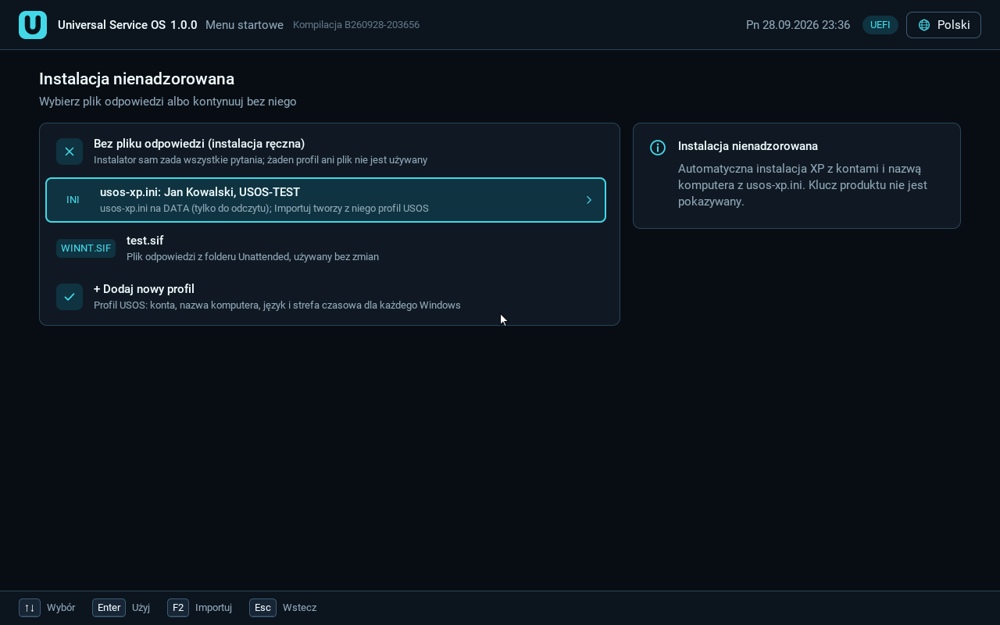
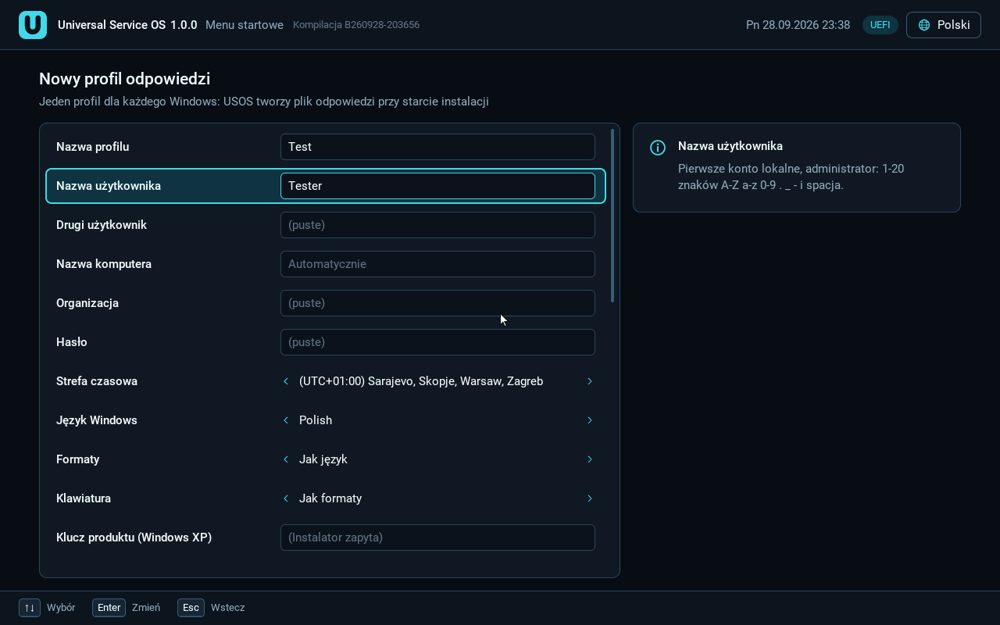

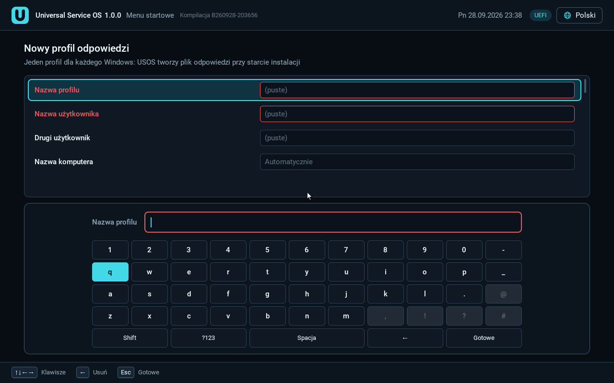

Profile tworzysz i edytujesz tylko w menu UEFI (instalator Windows nie ma
edytora). Ekran „Instalacja nienadzorowana” pojawia się po wybraniu obrazu.
Wiersze:

| Wiersz | Enter / A | F2 / X | Del / Y |
|---|---|---|---|
| Bez pliku odpowiedzi (instalacja ręczna) | instalator zada wszystkie pytania | | |
| XP: `usos-xp.ini: <użytkownik>, <komputer>` | XP bez pytań | import do nowego profilu | |
| Twoje profile USOS | użyj | edytuj | usuń (po potwierdzeniu) |
| pliki z folderu `Unattended\` | użyj bez zmian | | |
| **+ Dodaj nowy profil** | otwiera edytor | | |

Esc, B albo prawy przycisk myszy wracają. Profile są zapisywane na ESP
w `EFI\USOS\profiles\<nazwa>.ini`.

Tworzenie profilu krok po kroku:

1. Wybierz system i obraz ISO.
2. Na ekranie „Instalacja nienadzorowana” wybierz **+ Dodaj nowy profil**.
3. Wypełnij pola. Możesz pisać zwykłą klawiaturą albo klawiaturą ekranową
   (przydatne na Ally lub z padem). Błędna wartość zmienia kolor wiersza na
   czerwony, a panel pomocy mówi, co jest nie tak.
4. Zapisz. Profil pojawi się na liście. Wybierz go i uruchom instalację.

Działanie profilu na sprzęcie potwierdzono na X470 (utworzenie profilu
i instalacja z nim).

### 7.2 Pola profilu

- nazwa profilu, użytkownik (administrator), opcjonalny drugi użytkownik,
  nazwa komputera, organizacja, hasło (pokazywane jako kropki);
- strefa czasowa, język Windows, formaty, układ klawiatury;
- **klucz produktu** tylko dla systemu, z którego otwarto edytor;
- dla Windows 8 i nowszych: konto lokalne (bez ekranów konta online);
- dla Windows 11: pominięcie sprawdzania TPM, Secure Boot i RAM oraz
  „instalacja bez sieci”;
- dla Visty i nowszych: „Ochrona i aktualizacje”, „Wyłącz raportowanie
  błędów”; dla Visty/7: lokalizacja sieci;
- edycja (dla Visty i nowszych: wybór z listy obrazów w ISO albo „Instalator
  zapyta”);
- „Używaj dla”: tylko ten system, każdy Windows, każdy instalator Linuksa albo
  Windows i Linux;
- sekcja „Wygląd i dodatki” (7.3).

Profil jest pokazywany tylko przy systemach, do których pasuje. Gdy brakuje
czegoś, bez czego instalator się zatrzyma (np. klucza dla 2000/XP/2003 albo
hasła spełniającego politykę Windows Server), profil dostaje odznakę
„Niekompletny” i opis w panelu pomocy. Start nie jest blokowany.

### 7.3 Dodatki (tweaks)

Wszystkie są domyślnie wyłączone. Edytor pokazuje tylko te, które działają
dla danego systemu. Przykłady: bez gier, bez MSN, klasyczne menu Start (XP),
wyłączenie UAC (Vista/7), bez paska bocznego i Centrum powitalnego (Vista),
wyłączenie hibernacji, pokazywanie rozszerzeń plików i plików ukrytych,
wyłączenie autouruchamiania, rozdzielczość ekranu (XP/2003). Windows 2000 nie
ma dodatków.

### 7.4 Klucz produktu

- Klucz jest zapisywany w pliku **tylko** po zaznaczeniu „Zapamiętaj klucz
  na pendrivie”. Domyślnie wpisujesz go przy starcie i jest pamiętany
  tylko do restartu.
- USOS nie dostarcza żadnych kluczy.
- Hasło (i zapamiętany klucz) są zapisane na pendrivie jawnym tekstem.
  Menu nigdy nie pokazuje ich na listach ani w logach.
- USOS nie omija aktywacji ani strony klucza produktu.

### 7.5 Pliki w folderze `Unattended` i `usos-xp.ini`

- Pliki `.xml` (Windows 6.x+) i `.sif` (XP/2000) z
  `Systems\Windows\<system>\Unattended\` są używane bez zmian. USOS ostrzega,
  gdy plik jest dla innej architektury niż obraz.
- `Systems\Windows\Windows XP\Unattended\usos-xp.ini`: prosty plik dla XP
  bez pytań. Instalator tworzy go pusty (nieaktywny) i przy każdej
  aktualizacji zapisuje przykład `usos-xp.example.ini` z opisem. Wpisz co
  najmniej `user=`. Istniejący `usos-xp.ini` nigdy nie jest nadpisywany.
- Wybrany plik `.sif` jest łączony z automatyczną odpowiedzią USOS.
- Dla Windows 2000 ten sam plik leży w `Windows 2000\Unattended\usos-xp.ini`.

### 7.6 Polecenia bez okien konsoli

Na ścieżkach PE10/WinPE (Vista, 7, 10/11, Server) polecenia z profilu (np.
dodatki, sprawdzenia Windows 11) uruchamia ukryty program
`usos-run-hidden.exe`, więc nie migają okna konsoli. Log poleceń:
`%WINDIR%\Panther\usos-hidden-commands.log` w zainstalowanym systemie.
Nie dotyczy to startów BIOS przez wimboot ani przygotowania WORK dla 8/10/11.
Nadal widać: krótkie (około 1 s) mignięcie konsoli Windows PE zaraz po
starcie PE10 oraz okno „USOS - Vista USB diagnostics” przy pierwszym starcie
Visty (tam pojawia się ewentualny błąd USB).

### 7.7 Linux


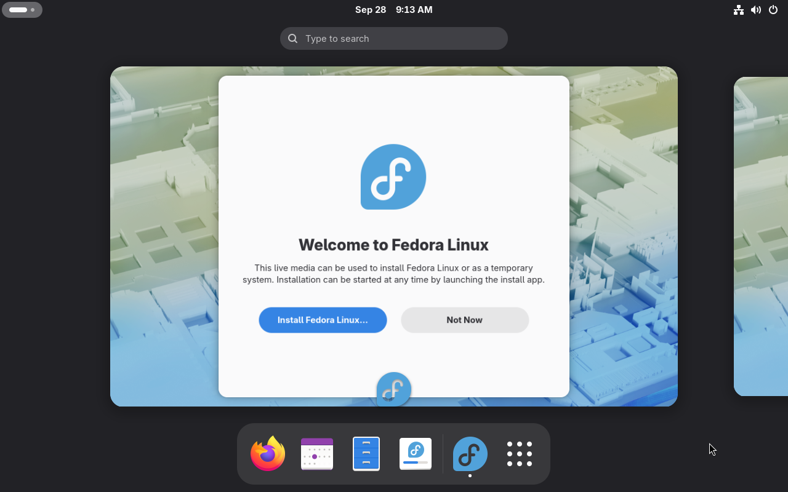

Profile działają dla ISO Ubuntu, Debiana i Fedory w trybie UEFI (nie w BIOS).
Hasło jest zapisywane tylko jako skrót SHA-512. Drugi użytkownik, organizacja
i klucze są pomijane. Instalator Ubuntu (subiquity) zatrzyma się na wyborze
dysku; sprawdź, który dysk jest zaznaczony (rozdział 9).

---

## 8. Motywy


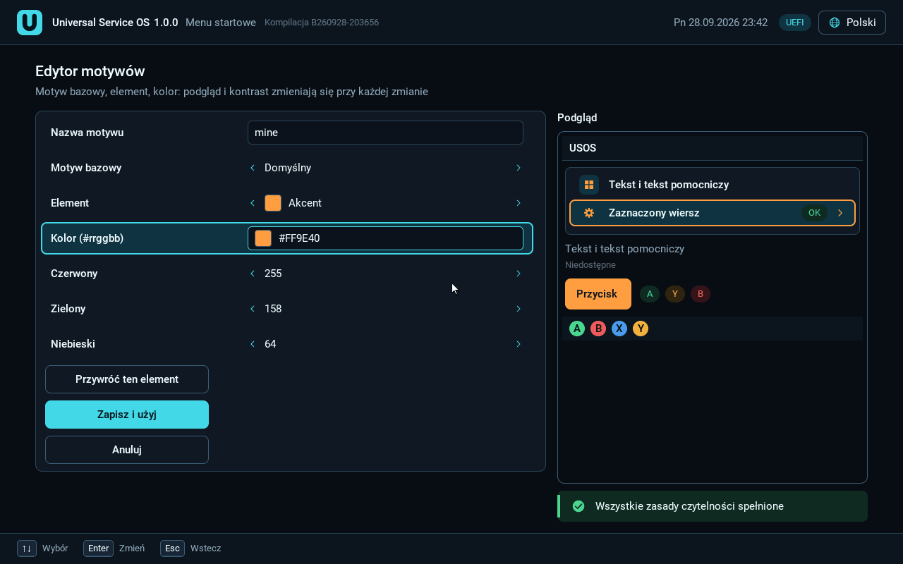

Wybór: **Narzędzia -> Motyw** w menu UEFI. Enter/A od razu stosuje motyw
i zapisuje go na pendrivie.

Motywy wbudowane (UEFI i BIOS):

| Nazwa | Wygląd |
|---|---|
| Domyślny (`default`) | paleta USOS |
| Ciemny (`dark`) | grafit, niebieski akcent |
| Jasny (`light`) | ciemny tekst na białym |
| Wysoki kontrast (`high-contrast`) | biały na czarnym, żółte zaznaczenie |
| Retro (`retro`) | biały i żółty na niebieskim, jak BIOS |

Przykładowe motywy na pendrivie: `usos-ocean` (granat i cyjan),
`usos-sunset` (ciepły brąz i pomarańcz), `usos-forest` (jasny, zielony).
Aktualizacja je nadpisuje; edytor zapisuje kopię pod Twoją nazwą.

### Edytor motywów (UEFI)

1. **Narzędzia -> Motyw** -> „Utwórz lub edytuj motyw”.
2. Podaj nazwę, wybierz motyw bazowy i element.
3. Wpisz kolor `#rrggbb` albo zmieniaj R/G/B strzałkami.
4. Obok widać podgląd na żywo. Jeśli kontrast jest za mały, pod podglądem
   jest komunikat, a zapis jest zablokowany.
5. Wybierz „Zapisz i użyj”. Motyw trafia do `EFI\USOS\themes\<nazwa>.ini`
   na ESP.

Edytor potwierdzono na X470.

### Motywy w BIOS

Menu BIOS używa motywów wbudowanych i motywów z `EFI\USOS\themes\` na ESP
(zapisanych edytorem UEFI). W BIOS działają **tylko kolory**, nie ma tam
edytora, a folder `DATA\Themes` nie jest czytany.

### Własny plik `theme.ini`

`DATA\Themes\<nazwa>\theme.ini` (tylko UEFI):

```
base=dark
accent=#ff9e40
accent_soft=#3a2410
```

Nieznany klucz, zły kolor albo zbyt słaby kontrast powoduje użycie motywu
domyślnego. Powód widać w **Narzędzia -> Motyw**.

---

## 9. Znane problemy i obejścia

### Windows Vista

- **Tryb testowy na X470.** Sterownik USB 3 dla Visty jest podpisany
  testowo, więc na pulpicie widać „Tryb testowy”. Nie istnieje prawidłowo
  podpisany sterownik xHCI dla X470 pod Vistę x64. Jedyne wyjście: karta
  PCIe USB 3 z układem **Renesas uPD72020x** i sterownikiem producenta.
- **Pendrive'y USB niewidoczne w zainstalowanej Viście** (płyty tylko z USB 3,
  np. X470). Klawiatura i mysz działają. Obejście: pliki przez sieć, drugi
  dysk wewnętrzny SATA, napęd optyczny, albo karta Renesas uPD72020x.
- Vista nie ma sterownika NVMe. Instaluj na dysk SATA.
- Vista bez CSM (CSMWrap): dysk docelowy jest **całkowicie kasowany**
  i dostaje układ MBR (do 2 TiB). Wybór dysku jest w osobnym kroku USOS,
  potem potrzebny jest restart przed Instalatorem Visty. Po instalacji
  wyjmij pendrive albo w menu startowym wybierz wpis UEFI dysku.
- Na MS-7100 automatyczny restart Visty (BIOS) wymagał ręcznej pomocy.

### CSMWrap (XP, Vista, 2000, 2003, XP x64 bez CSM)

- USOS wybiera CSMWrap sam, gdy firmware nie ma CSM.
- Potrzebna jest karta graficzna z **klasycznym VBIOS** (option ROM
  zgodny z CSM). Bez niego ekran będzie czarny.
- CSMWrap rezerwuje **jeden rdzeń procesora**; system widzi o jeden mniej.
- Na dysku docelowym powstaje mała partycja ESP z CSMWrap (64 MiB, na końcu
  dysku). Jest potrzebna przy każdym starcie tego systemu.
- Wymaga wyłączonego Secure Boot.
- Przy starcie w lewym górnym rogu miga kursor tekstowy, dopóki system nie
  zmieni trybu ekranu. To kosmetyka.
- Log CSMWrap na ekranie: utwórz pusty plik `EFI\USOS\csmwrap-verbose.flag`
  na pendrivie.

### Windows XP

- Brak NVMe (także z CSM). Instaluj na dysk SATA.
- XP w trybie BIOS nie ma pakietu sterowników ani PAE. Te funkcje są tylko
  w wariancie UEFI (pakiet XP, rozdział 3.3).
- Pakiet XP działa tylko z dwoma obrazami z rozdziału 3.3.

### Windows Server 2003 i XP x64

- **Brak klawiatury i myszy USB na płytach tylko z USB 3** (np. X470):
  te systemy nie mają sterownika xHCI. Użyj klawiatury PS/2, płyty z USB 2.0
  (EHCI) albo profilu odpowiedzi z kluczem (Server 2003 dochodzi wtedy do
  pulpitu bez klawiatury). Dla XP x64 zalecana jest karta Renesas uPD720202
  z oficjalnym sterownikiem (włóż go do `Drivers\Windows XP x64\USB\`).
- **STOP 0xA5 (ACPI) na X470.** Oba systemy zatrzymały się na X470
  z błędem 0xA5 (ACPI_BIOS_ERROR) na początku trybu tekstowego: ich
  sterownik ACPI nie rozumie tablic nowszych płyt. Server 2003 x86 dostał
  od tego czasu zamiennik ACPI (ten sam co XP x86); w QEMU dochodzi do GUI
  Setup, ale na X470 poprawki jeszcze nie sprawdzono. **XP x64 na X470
  pozostaje zablokowany** przez 0xA5: USOS nie może dołączyć sterownika
  ACPI x64, a obsługa własnego zamiennika nie jest jeszcze zrobiona.
  Tryb „bez ACPI” (F7) nie jest realną opcją na tych płytach.

### Windows 2000

- Nie działa na X470 i podobnych płytach bez trybu IDE: Windows 2000 nie ma
  sterownika AHCI, a pakiet sterowników XP nie działa na NT 5.0.

### Windows 7

- Intel 11. - 14. generacja z włączonym VMD: brak dysku. Wyłącz VMD/RST.
- Grafika Intel Xe/UHD 730/770 i RDNA2 (AM5) nie ma sterowników dla
  Windows 7: potrzebna jest osobna karta, inaczej zostaje 800x600.
- Obsługiwany jest tylko Windows 7 x64 w UEFI.

### Windows Server

- Windows Server 2012 (nie R2) nie ma sterownika NVMe w Instalatorze. Menu
  podpowie, żeby włożyć go do `Drivers\Windows Server 2012\Storage`.

### Linux

- **SystemRescue wymaga wyłączonego Secure Boot.**
- **Ubuntu Desktop przy włączonym Secure Boot**: w emulatorze instalator
  pokazał błąd („Something went wrong”); na sprzęcie nie sprawdzono.
- **Ubuntu Server z profilem**: instalator (subiquity) sam zaznacza
  **największy dysk**. Może to być pendrive USOS. Zawsze sprawdź dysk
  przed potwierdzeniem.
- Obraz ISO musi leżeć w jednym kawałku na DATA. Jeśli menu zgłosi
  pofragmentowany plik, skopiuj ISO ponownie.
- Profile odpowiedzi dla Linuksa działają tylko w UEFI.

### Mikro-Linux i stare komputery

- Przygotowanie wielu instalacji (XP, 2000, 2003, Windows 7 w BIOS) robi
  wbudowany mikro-Linux. Wymaga on procesora **x86-64** (Athlon 64,
  Pentium 4 z EM64T i nowsze) oraz **256 MiB RAM**. Samo menu BIOS działa
  też na starszych 32-bitowych procesorach.
- Windows 98 i DOS działają tylko w trybie BIOS (Legacy).

### Firmware AMI (np. ASRock)

- Menu startowe pokazuje **każdą partycję pendrive'a** jako osobny wpis
  „UEFI: <pendrive>, Partition N”. Nie da się tego usunąć. Plik startowy
  USOS jest tylko na partycji ESP (pierwszej na pendrivie).

### Secure Boot

- Powłoka UEFI przy włączonym Secure Boot startuje, ale **nie uruchamia
  żadnych narzędzi .efi** (nawet podpisanych). Wyłącz Secure Boot albo włóż
  podpisane narzędzie do `Utilities\<Nazwa>\Images\` i uruchom je z menu.
- Menu Linuksa i Windows 10/11 przy włączonym Secure Boot: patrz tabela
  w rozdziale 5.

---

## 10. Czego jeszcze nie sprawdzono

Uczciwa lista rzeczy, które w wersji 1.0 **nie zostały sprawdzone na
prawdziwym sprzęcie** (albo wcale):

- Windows 7 SP1 z oryginalnego ISO (retail) przez dawcę PE10.
- Windows Server 2008, 2008 R2, 2012, 2012 R2, 2016, 2019, 2022, 2025:
  żaden obraz Server nie był uruchomiony ani w emulatorze, ani na sprzęcie.
- Windows 8 i 8.1.
- Windows 10 i 11 z włączonym Secure Boot na sprzęcie.
- Windows 11 w trybie BIOS.
- Server 2003 z nowym zamiennikiem ACPI, XP x64 oraz Windows 2000 na X470.
- XP i Server 2003 / XP x64 w trybie BIOS (XP x86 tylko w maszynach
  wirtualnych; 2003 i XP x64 wcale).
- XP bez CSM (CSMWrap): zgłoszenie pamięci (PAE / 31,9 GB), liczby
  procesorów i USB jeszcze nie przyszło.
- Linux na sprzęcie: pierwsza runda na X470 objęła Mint, Fedorę, Debian
  netinst, SystemRescue, Clonezillę i GParted (Secure Boot wyłączony) oraz
  Fedorę i Mint (Secure Boot włączony). Ubuntu (Server i Desktop) i Debian
  live nie były uruchamiane na sprzęcie. Poprawki po tej rundzie (m.in. brak
  komunikatu „Verification failed” przed Mintem, poprawne długie nazwy
  plików w menu BIOS) nie są jeszcze potwierdzone na sprzęcie.
- Ostatnie poprawki przed 1.0, jeszcze nie na sprzęcie:
  - ukryte uruchamianie poleceń (`usos-run-hidden.exe`),
  - cichy CSMWrap (bez logo i napisów SeaBIOS) na X470, dla XP i Visty,
  - Vista w UEFI z CSM z profilem odpowiedzi,
  - ikony XP x64 i Server 2003,
  - motywy użytkownika w menu BIOS.
- Powłoka UEFI na prawdziwym komputerze.
- Sterowniki użytkownika z `DATA\Drivers` na prawdziwym komputerze
  (sprawdzone w emulatorze).

---

## 11. Rozwiązywanie problemów i logi

### Najczęstsze sytuacje

| Objaw | Co zrobić |
|---|---|
| Instalator nie widzi pendrive'a jako „Gotowe” | Przeczytaj powód odrzucenia. Najczęściej: za mały (poniżej 32 GiB) albo nie zgłasza się jako wymienny. |
| Instalator pisze „Nośnik jest używany” | Zamknij okna Eksploratora pokazujące pendrive i kliknij Ponów. |
| Pendrive nie startuje | Uruchom **Naprawa -> Napraw ESP**. |
| W UEFI Vista / Windows 7 są zablokowane | Brak lub zmiana dawcy PE10: rozdział 3.2, potem **Aktualizuj USOS**. |
| „Verification failed” przy starcie | Brak klucza USOS: rozdział 6. |
| System ma odznakę „Wymaga wyłączenia Secure Boot” | Wyłącz Secure Boot w BIOS. |
| System ma odznakę „Wymaga BIOS” | Uruchom pendrive w trybie Legacy (włącz CSM). |
| Czarny ekran przy XP/Viście bez CSM | Karta graficzna bez klasycznego VBIOS; włącz CSM albo użyj innej karty. |
| XP nie pojawia się w menu UEFI | Brak pakietu XP: rozdział 3.3. |

### Gdzie są logi

Logi pomagają, gdy zgłaszasz problem. Większość jest na partycji
**USOS_ESP** pendrive'a (widać ją w Windows jako zwykły dysk FAT32).

Instalator (Windows):

- `USOS Installer.log` obok pliku `USOS Installer.exe`;
- w oknie postępu przycisk **Pokaż log**.

Na pendrivie, `USOS_ESP\EFI\USOS\Logs\`:

- `input-devices.txt`: przy każdym starcie; urządzenia wejścia, tryby ekranu
  (GOP i tekstowe) oraz sekcja `[SECURE BOOT]` (stan Secure Boot i klucza);
- `drivers.txt`: sterowniki UEFI z `DATA\Drivers\UEFI`;
- `secure-boot-<UUID>.ini`: stan klucza USOS dla danego komputera;
- `acpi\<UUID>\`: kopia tablic ACPI danego komputera;
- `WinSetup-<czas>-<PID>\`: logi Instalatora Windows z WinPE
  (`usos-startup.log`, `setupact.log`, `setuperr.log`, `setupapi.dev.log`,
  `dism.log`);
- `vista-install.log`: instalator Visty (w katalogu danego przebiegu).

Przygotowanie XP, 2000, 2003 i XP x64:

- z UEFI: `USOS_ESP\EFI\USOS-XP\` (`legacy-xp-*.log`, np.
  `legacy-xp-csmwrap.log`, oraz `menu-events.log`, `menu-hardware.txt`,
  `legacy-xp-staging-last-error.txt`);
- z BIOS: `USOS_ESP\EFI\USOS\legacy-xp-*.log`.

W zainstalowanym systemie:

- `%WINDIR%\Panther\usos-hidden-commands.log`: polecenia profilu (Vista, 7,
  10/11, Server);
- XP: `C:\USOS\XP\pae-install.log` oraz `%SystemRoot%\usos-users.log`
  (konta z `usos-xp.ini`);
- Windows 2000, Server 2003, XP x64: `%SystemRoot%\usos-setup.log`;
- Vista: `<dysk Visty>:\USOS\Vista\firstboot-usb.log` (pierwszy start, USB);
- Windows 7 bez CSM: na ESP dysku docelowego
  `EFI\Microsoft\Boot\usos-boot-uefiseven.log` i `UefiSeven.log`.

Pliki odpowiedzi użytkownika mogą zawierać hasła i klucze, więc nie są
kopiowane do logów automatycznie. Zanim komuś wyślesz logi, sprawdź, czy nie
ma w nich Twoich danych.

---

## 12. Podziękowania

USOS korzysta z pracy wielu projektów open source, m.in.: shim (Fedora),
EDK2 UEFI Shell, CSMWrap i SeaBIOS, UefiSeven, wimboot, EfiFs (sterownik
NTFS), Alpine Linux (mikro-Linux), FreeDOS i Doszip, Patcher9x, wimlib,
ImDisk, GenAHCI oraz TouchI2cDxe. Zestaw ustawień profili odpowiedzi opiera
się na katalogu generatora Christopha Schneegansa (tylko wiedza, bez kodu).

Sam USOS jest wolnym oprogramowaniem na licencji GNU GPL w wersji 3 lub
nowszej (`LICENSE.txt` i `NOTICE.txt` w wydaniu). Pełna lista pozostałych
składników, ich licencje i źródła: pliki `THIRD-PARTY-NOTICES.txt` i
`LICENSES` dołączone do wydania. Audyt licencji: [LICENSES-AUDIT.md](LICENSES-AUDIT.md).

Windows, MS-DOS i powiązane nazwy są znakami towarowymi Microsoft. USOS nie
jest powiązany z Microsoft ani z autorami wymienionych projektów.
