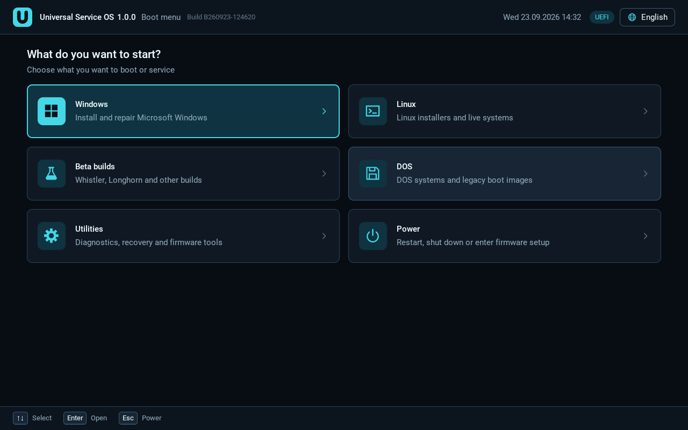
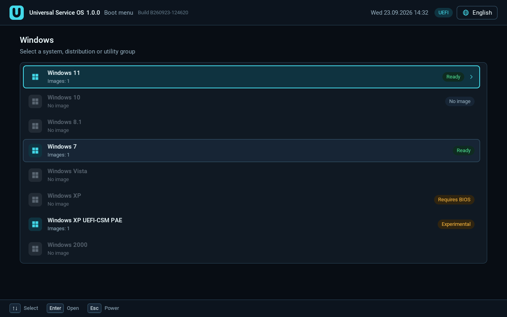
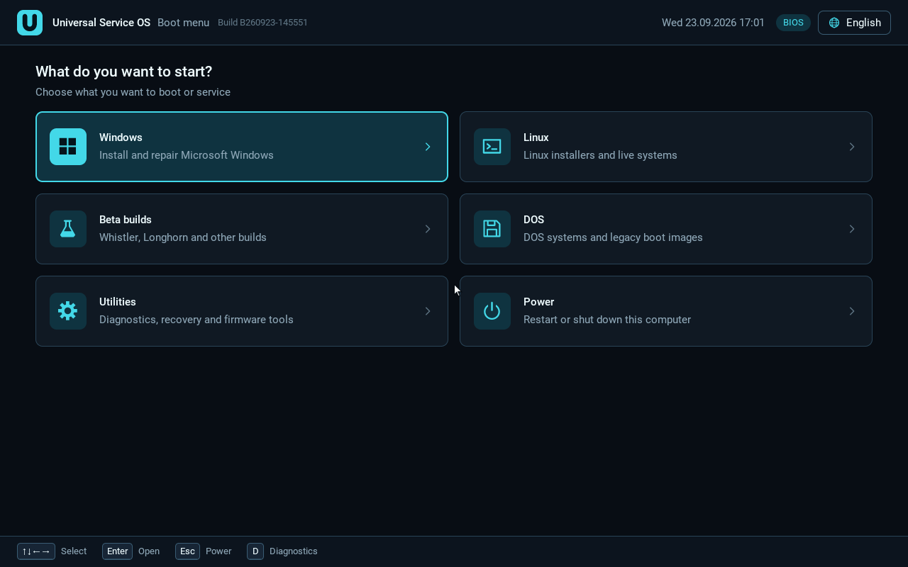
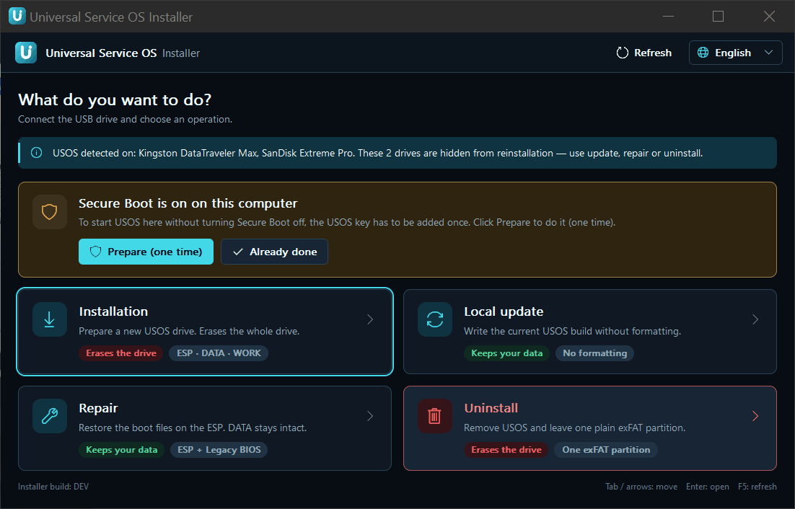
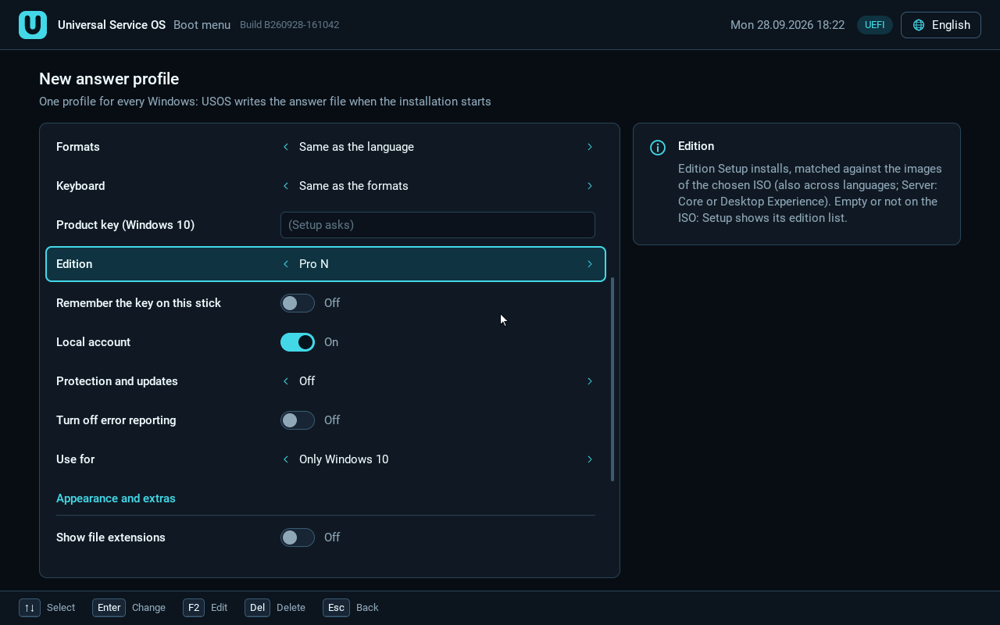

# Universal Service OS (USOS) 1.0.0

> Tämä on käännös. Sitova versio on [englanninkielinen README](../../README.md).

**Kielet:** [English](../../README.md) ·
[Български](README.bg.md) ·
[Čeština](README.cs.md) ·
[Dansk](README.da.md) ·
[Deutsch](README.de.md) ·
[Ελληνικά](README.el.md) ·
[Español](README.es.md) ·
[Eesti](README.et.md) ·
Suomi ·
[Français](README.fr.md) ·
[Hrvatski](README.hr.md) ·
[Magyar](README.hu.md) ·
[Italiano](README.it.md) ·
[Lietuvių](README.lt.md) ·
[Latviešu](README.lv.md) ·
[Norsk bokmål](README.nb.md) ·
[Nederlands](README.nl.md) ·
[Polski](README.pl.md) ·
[Português (Brasil)](README.pt-BR.md) ·
[Română](README.ro.md) ·
[Русский](README.ru.md) ·
[Slovenčina](README.sk.md) ·
[Slovenščina](README.sl.md) ·
[Srpski (latinica)](README.sr-Latn.md) ·
[Svenska](README.sv.md) ·
[Türkçe](README.tr.md) ·
[Українська](README.uk.md)

## Sisällys

1. [Mikä USOS on](#what-usos-is)
2. [Ominaisuudet](#features)
3. [Tuetut järjestelmät ja laiteohjelmistotilat](#supported-systems)
4. [Pika-aloitus](#quick-start)
5. [DATA-osion kansiorakenne](#data-layout)
6. [Secure Boot](#secure-boot)
7. [Vastausprofiilit](#answer-profiles)
8. [Tunnetut ongelmat](#known-issues)
9. [Kääntäminen lähdekoodista](#building)
10. [Lisenssi](#licence)
11. [Tuki](#support)
12. [Dokumentaatio](#documentation)

<a id="what-usos-is"></a>
## 1. Mikä USOS on

USOS on yksi USB-tikku, jolla asennat ja käynnistät käyttöjärjestelmiä
MS-DOSista Windows 11:een ja Linuxiin BIOS- ja UEFI-tietokoneissa, myös
UEFI-koneissa, joissa Secure Boot on käytössä. Kopioit omat ISO-levykuvasi
tikulle tavallisina tiedostoina; USOS antaa yhden valikon, nimenomaisen ja
suojatun kohdelevyn valinnan sekä ajurit ja korjaukset, joita vanhat
järjestelmät tarvitsevat uudella laitteistolla. Tikku valmistellaan
Windowsissa ohjelmalla `USOS-Installer-1.0.0.exe`. USOS ei sisällä
Windows-levykuvia, tuoteavaimia eikä mitään aktivoinnin ohittamiseen.



<a id="features"></a>
## 2. Ominaisuudet

- **Yksi valikko BIOSille ja UEFIlle.** Sama tikku käynnistyy Legacy
  BIOS -tilassa ja UEFI-tilassa (x64) samalla luettelolla. UEFI-valikko
  toimii näppäimistöllä, hiirellä, kosketusnäytöllä ja USB-peliohjaimilla.
- **Levykuvat pysyvät tiedostoina.** ISO-, WIM-, IMG-, VHD-, VHDX- ja
  EFI-levykuvat luetaan suoraan NTFS-muotoiselta DATA-osiolta; mitään ei
  pureta eikä mitään tarvitse ajaa kopioinnin jälkeen.
- **Suojattu kohdelevy.** Valitset ja vahvistat levyn aina itse; itse
  USOS-tikkua ei koskaan tarjota kohteeksi.
- **Secure Boot** shim 16.1:n (Microsoftin allekirjoittama) ja USOS-avaimen
  (MOK) kautta; avain rekisteröidään kerran kutakin tietokonetta kohden.
- **Vanhat Windowsit uudella laitteistolla.** Windows XP ajuripaketin ja
  PAE:n kanssa UEFI-tilassa CSM:llä; XP ja Vista UEFI-tilassa ilman CSM:ää
  CSMWrapin avulla (kokeellinen); Windows 7 x64 ilman CSM:ää UefiSevenin ja
  VGA:n näytönohjaimelle ohjaavan välittäjän (dispatcher) avulla; USB 3- ja
  NVMe-integrointi Windows 7:lle.
- **Vastausprofiilit** Windowsin ja Linuxin valvomattomiin asennuksiin;
  niitä muokataan UEFI-valikossa näyttönäppäimistöllä.
- **Linux-ISO:t DATA-osiolta** (Ubuntu, Mint, Fedora, Debian,
  SystemRescue, GParted, Clonezilla ja muut) UEFI-tilassa Secure Bootin
  kanssa ja ilman sekä BIOS-tilassa.
- **Työkalut:** sisäänrakennettu FreeDOS tiedostonhallinnalla ja Hardware &
  SMART -paneeli (BIOS), EDK2:n UEFI-komentotulkki (UEFI), omat
  käynnistettävät työkalusi kansiossa `Utilities`, omat UEFI-ajurisi ja
  Windowsin INF-ajurikansiot.
- **Asennusohjelmassa neljä tilaa:** Asennus, Päivitys (**Päivitä USOS**,
  säilyttää levykuvat ja tiedostosi), Korjaus (**Korjaa ESP**), Poisto.
- **27 kieltä** (englanti on viitekieli; muut kielet puolaa lukuun ottamatta
  on merkitty osittain tai kokonaan konekäännetyiksi), teemat ja niiden
  muokkain valikossa, kosketus- ja peliohjaintuki ROG Allyssa.

| | |
|---|---|
|  |  |
| Windows-järjestelmät tilamerkintöineen | Linux-ISO:t DATA-osiolta |
|  |  |
| Legacy BIOS -valikko | Teemat: Dark, Light, Retro, Sunset |

<a id="supported-systems"></a>
## 3. Tuetut järjestelmät ja laiteohjelmistotilat

**HW** = testattu oikealla laitteistolla, **VM** = testattu vain
QEMUssa/VirtualBoxissa, **kok.** = kokeellinen (merkitty valikossa
sellaiseksi), **testaamaton** = reitti on olemassa, mutta ajoa ei ole
kirjattu, **—** = ei tuettu (valikko näyttää syyn). Testikoneet: **X470**
(ASRock X470, Ryzen 7 5700X, Radeon RX 560, UEFI), **MS-7100** (MSI,
Socket 939, Athlon 64 X2, BIOS), **Ally** (ASUS ROG Ally RC71L, UEFI ja
Secure Boot).

| Järjestelmä | BIOS (Legacy) | UEFI + CSM | UEFI ilman CSM:ää (CSMWrap) | Secure Boot käytössä |
|---|---|---|---|---|
| Itse USOS-valikko | HW | HW | HW | HW (X470, Ally) |
| MS-DOS 6.22, Windows 3.1/3.11 | HW (Windows 3.1 vakiotilassa, MS-7100) | — | — | — |
| Windows 98 SE | VM; HW osittain (MS-7100: Setup ensimmäisen käynnistyksen valmisteluun asti, työpöytää ei vahvistettu) | — | — | — |
| Windows 2000 SP4 | HW (MS-7100) | kok., VM (tiedostojen kopiointiin asti) | kok., VM (CSMWrap) | — |
| Windows XP x86 SP3 | VM (ei ajuripakettia, ei PAE:ta) | HW (X470: ajuripaketti, PAE, 31,9 GB) | kok., HW (X470, CSMWrap) | — |
| Windows XP x64 SP2 | testaamaton | kok., VM (GUI Setupiin asti); X470: STOP 0xA5 | kok., VM (CSMWrap) | — |
| Windows Server 2003 R2 SP2 x86 | testaamaton | kok., VM (GUI Setupiin asti); X470 testaamaton 1.0:lla | kok., VM (CSMWrap) | — |
| Windows Vista SP2 x64 | HW (MS-7100) | HW (X470) | kok., HW (X470, CSMWrap, legacy MBR) | — |
| Windows 7 SP1 x64 | HW (MS-7100) | VM (täysi asennus) | HW (X470, UefiSeven + välittäjä) | — |
| Windows 8 / 8.1 | testaamaton | testaamaton | testaamaton | testaamaton |
| Windows 10 | HW (x86, MS-7100) | HW (x64, X470) | natiivi UEFI, sama reitti kuin CSM:llä | VM (Windowsin lataajaan asti) |
| Windows 11 | testaamaton | HW (käyttäjän raportti) | natiivi UEFI, sama reitti kuin CSM:llä | VM (Windowsin lataajaan asti) |
| Windows Server 2008 - 2025 | kok., ei koskaan käynnistetty | kok., ei koskaan käynnistetty | kok., ei koskaan käynnistetty | 2008/2008 R2: —; 2012+: testaamaton |
| Linux-ISO:t (Ubuntu, Mint, Fedora, Debian, GParted, Clonezilla) | VM; HW Mint live (MS-7100) | HW (X470: Mint, Fedora, Debian netinst, Clonezilla, GParted) | kuten CSM:llä | HW Fedora, Mint (X470); muut VM |
| SystemRescue | VM | HW (X470) | kuten CSM:llä | — (ei allekirjoitettua käynnistyslataajaa) |
| FreeDOS, Hardware & SMART (sisäänrakennettu) | VM (FreeDOS); HW (Hardware & SMART) | — | — | — |
| MemTest86+ (i586-ISO, hankit itse) | HW | `.efi`-versio kansiosta `Utilities` (testaamaton) | kuten CSM:llä | vain allekirjoitettu `.efi` |
| UEFI-komentotulkki (sisäänrakennettu) | — | VM | VM | VM (käynnistyy, ei voi käynnistää työkaluja) |

UEFI CSM:n kanssa tai ilman merkitsee jotain vain legacy-reiteille (2000,
XP, 2003, Vista, 7); kaikki muut UEFI-kohdat ajavat samaa koodia
molemmissa tiloissa. Windows XP, Vista ja 7 sekä kaikki CSMWrap-reitit
vaativat, että Secure Boot on pois käytöstä. Täysi taulukko huomautuksineen
ja käännöskohtaiset laitteistotulokset löytyvät
[käyttöoppaan luvusta 5](../USER-GUIDE.en.md#5-what-works-in-which-firmware-mode)
ja [julkaisutiedoista](../release-notes-1.0.md#supported-systems)
(englanniksi).

<a id="quick-start"></a>
## 4. Pika-aloitus

Julkaisun tiedostot:

**Et tiedä kumpi? Lataa täysi asennusohjelma.**

| Tiedosto | Tarkoitus |
|---|---|
| `USOS-Installer-1.0.0.exe` | **Täysi asennusohjelma**: koko USOS sekä WinPE-luovuttaja ja molemmat XP-paketit; toimii ilman verkkoa |
| `USOS-Installer-1.0.0-online.exe` | **Verkkoasennusohjelma**: pieni lataus; hakee WinPE-luovuttajan ja XP-paketit tästä julkaisusta tarvittaessa ja tarkistaa ne |
| `USOS-1.0.0-WinPE-PE10-donor.zip` | PE10-luovuttaja, tarvitaan Vistaan ja alkuperäisiin Windows 7 -ISO:ihin UEFI-tilassa |
| `USOS-1.0.0-XP-package-PL.zip`, `USOS-1.0.0-XP-package-EN.zip` | Windows XP x86 SP3:n UEFI-paketti, kukin täsmälleen yhdelle alkuperäiselle ISO:lle (`pl_..._x14-80476.iso` / `en_..._x14-80428.iso`), asennetaan mukana tulevalla `install-xp-package.ps1`:llä |
| `USOS-1.0.0-sources.zip` + `SOURCE-OFFER.txt` | kolmannen osapuolen komponenttien lähdekoodit ja kirjallinen lähdekooditarjous |
| `USOS-1.0.0-buildkit.zip` | lukitut työkaluketjut ja käännöksen syötteet verkottomaan uudelleenkääntämiseen |
| `LICENSES/`, `THIRD-PARTY-NOTICES.txt` | lisenssitekstit ja ilmoitukset |
| `SHA256SUMS` | jokaisen tiedoston SHA-256 |

Tarkista lataus komennolla `certutil -hashfile USOS-Installer-1.0.0.exe SHA256`
(tai PowerShellin `Get-FileHash`) vertaamalla tiedostoon `SHA256SUMS`.



1. Hanki USB-tikku, jonka koko on **vähintään 32 GiB** (käytännössä 64 GB;
   ”32 GB” -merkinnällä myyty tikku on yleensä liian pieni). **Kaikki sillä
   oleva poistetaan.**
2. Aja Windows-tietokoneella `USOS-Installer-1.0.0.exe` (se pyytää
   järjestelmänvalvojan oikeuksia), valitse **Asennus**, valitse tikku,
   kirjoita vahvistusteksti ja napsauta **TYHJENNÄ JA ASENNA**.
3. Kopioi ISO-levykuvasi DATA-osiolle kunkin järjestelmän kansioon
   `Images`, esim. `Systems\Windows\Windows 11\Images\`.
4. Valinnainen: Vistaa tai alkuperäistä Windows 7:ää varten UEFI-tilassa
   kopioi kansio `Programs` PE10-luovuttajan zip-tiedostosta DATA-osion
   juureen ja aja **Päivitä USOS**; XP:tä varten UEFI-tilassa aja
   järjestelmänvalvojana `install-xp-package.ps1` ISO:osi mukaisesta
   XP-paketista (yksi paketti kerrallaan).
5. Käynnistä kohdetietokone tikulta (BIOS tai UEFI). Jos Secure Boot on
   käytössä, rekisteröi USOS-avain kerran ([Secure Boot](#secure-boot)).
   Valitse järjestelmä ja levykuva, halutessasi vastausprofiili, vahvista
   kohdelevy ja seuraa järjestelmän asennusohjelmaa.

Vaiheittaiset ohjeet jokaiselle näytölle ovat
käyttöoppaassa: [English](../USER-GUIDE.en.md), [Polski](../USER-GUIDE.pl.md).

<a id="data-layout"></a>
## 5. DATA-osion kansiorakenne

Asennusohjelma luo tikulle kolme osiota: `USOS_ESP` (FAT32, 1 GiB:
käynnistystiedostot, avain, asetukset, lokit, profiilit), `USOS_DATA`
(NTFS: tiedostosi) ja `USOS_WORK` (NTFS, työtila joillekin Windowsin
asennusohjelmille). Kaikki DATA-osion kansiot luodaan puolestasi:

```
USOS_DATA\
├─ Systems\
│  ├─ Windows\<versio>\     Images\  Unattended\   (Windows 3.1:stä 11:een, Server 2003-2025)
│  ├─ Linux\<jakelu>\       Images\  Unattended\   (Other Linux\ tuntemattomille ISO:ille)
│  ├─ Betas\
│  └─ DOS\<muunnelma>\      Images\
├─ Utilities\
│  ├─ FreeDOS\Programs\     DOS-ohjelmat sisäänrakennetulle FreeDOSille
│  ├─ UEFI Shell\Tools\     EFI-työkalut UEFI-komentotulkille
│  └─ <oma työkalusi>\Images\   esim. MemTest86\Images\memtest86.efi
├─ Drivers\
│  ├─ UEFI\<nimi>\          .efi-ajurit, jotka USOS-valikko lataa
│  └─ <Windows-versio>\     Storage\  USB\  Other\  (INF-paketit)
├─ Themes\<nimi>\theme.ini  omat teemasi (UEFI-valikko)
└─ Programs\
   └─ USOS\                 USOSin hallinnoima (PE10-luovuttaja), älä koske
```

Kun olet lisännyt tiedoston `icon.png` tai uuden työkalukansion, aja
**Päivitä USOS**. Koko puu on
[käyttöoppaan luvussa 4](../USER-GUIDE.en.md#4-folder-layout-on-data).

<a id="secure-boot"></a>
## 6. Secure Boot

Kun Secure Boot on käytössä, USOS käynnistyy **shim 16.1:n** (Fedoran
käännös, Microsoft UEFI CA:n allekirjoittama) ja MokManagerin kautta. Itse
USOS ja sen komponentit on allekirjoitettu **USOS-avaimella**, joka
rekisteröidään **kerran kutakin tietokonetta kohden**:

- **Helpoin tapa:** poista Secure Boot käytöstä, käynnistä tikulta, valitse
  aloitusnäytössä **Lisää** ja vahvista valinnalla **Kyllä, tallenna
  avain**, ja ota sitten Secure Boot taas käyttöön. Tämä toimii myös Setup
  Mode -tilassa (vahvistettu X470:llä).
- **Secure Boot käytössä pitäen:** kun näkyviin tulee ”Verification
  failed”, valitse MokManagerissa **Enroll key from disk** -> `USOS_ESP` ->
  `USOS-KEY.cer` (vahvistettu ROG Allylla). Asennusohjelman kortti
  **Valmistele (kerran)** saa MokManagerin odottamaan laskurin sijaan.

NVRAM-nollaus poistaa avaimen; rekisteröi se silloin uudelleen. XP, Vista,
7, kaikki CSMWrap-reitit, SystemRescue ja UEFI-komentotulkista käynnistetyt
työkalut vaativat, että Secure Boot on pois käytöstä. Ydintä ei ole vielä
lukittu (tiekartan kohta N6), joten USOS-avaimen rekisteröinti tarkoittaa,
että luotat kaikkeen sillä allekirjoitettuun. Lisätietoja:
[käyttöopas, luku 6](../USER-GUIDE.en.md#6-secure-boot-and-the-usos-key-mok),
[secure-boot-usos.md](../secure-boot-usos.md).

<a id="answer-profiles"></a>
## 7. Vastausprofiilit

Yksi pieni profiili (tilit, tietokoneen nimi, kieli, aikavyöhyke,
valinnaiset säädöt) muunnetaan käynnistyksessä tiedostoksi `WINNT.SIF`
(2000/XP/2003), `autounattend.xml` (Vistasta 11:een, Server) tai Ubuntun
autoinstalliksi, Debianin preseediksi tai Fedoran kickstartiksi. Profiilit
luodaan UEFI-valikossa (**Valvomaton asennus** -> **+ Lisää uusi
profiili**) ja tallennetaan ESP-osiolle.



- Kohdelevy **valitaan aina käsin**; profiili ei koskaan valitse eikä
  tyhjennä levyä.
- Tuoteavain tallennetaan vain, jos valitset ”Muista avain tällä
  tikulla”; muuten se säilyy vain uudelleenkäynnistykseen asti. **USOS ei
  sisällä avaimia** eikä ohita aktivointia tai tuoteavainsivua.
- Salasanat ja muistetut avaimet tallennetaan tikulle selkotekstinä (niitä
  ei koskaan näytetä luetteloissa tai lokeissa). Linux-profiilit toimivat
  vain UEFI-tilassa.

Lisätietoja: [käyttöopas, luku 7](../USER-GUIDE.en.md#7-answer-profiles-and-tweaks),
[answer-profiles.md](../answer-profiles.md).

<a id="known-issues"></a>
## 8. Tunnetut ongelmat

- **Vista emolevyillä, joissa on vain USB 3 (X470):** USB-muistitikut eivät
  näy asennetussa järjestelmässä, ja Vista jää testitilaan
  (testiallekirjoitettu USB 3 -takaportti). Renesas uPD72020x -piirillä
  varustettu PCIe-kortti välttää molemmat.
- **CSMWrap-reitit:** vaativat näytönohjaimen, jossa on legacy-VBIOS (muuten
  näyttö jää mustaksi), vievät yhden suoritinsäikeen, tarvitsevat
  MBR-kohdelevyn (joka tyhjennetään) ja Secure Bootin pois käytöstä.
- **Server 2003 x86 / XP x64:** STOP 0xA5 (ACPI) X470:llä, eikä
  USB-syötettä emolevyillä, joissa on vain xHCI.
- **Windows 2000** ei toimi emolevyillä, joissa on vain AHCI (NT 5.0:lle ei
  ole AHCI-ajuria); **XP** ei tue NVMe:tä eikä saa BIOS-tilassa
  ajuripakettia eikä PAE:ta.
- **Secure Boot:** SystemRescue estetään (ei allekirjoitettua lataajaa);
  UEFI-komentotulkki ei voi käynnistää työkaluja; BlackLotus-korjauksen
  sisältävän DBX-päivityksen jälkeen vanhemmat Windows-asennusmediat eivät
  käynnisty.
- **Linux:** Ubuntu Serverin asennusohjelma esivalitsee suurimman levyn,
  joka voi olla USOS-tikku; tarkista kohde aina.
- **AMI-laiteohjelmisto** näyttää tikun jokaisen osion omana
  käynnistyskohtanaan.
- Mikro-Linux-apuohjelma vaatii x86-64-suorittimen ja vähintään 256 MiB
  RAM-muistia.

Täysi luettelo kiertoteineen sekä rehellinen luettelo siitä, mitä **ei ole
vielä testattu** laitteistolla (esim. Windows Server 2008-2025, Windows
8/8.1, Windows 10/11 Secure Bootin kanssa laitteistolla, alkuperäinen
Windows 7 SP1 -ISO PE10-luovuttajan kautta), löytyvät
[julkaisutiedoista](../release-notes-1.0.md#known-issues) (englanniksi) ja
[käyttöoppaan luvuista 9 ja 10](../USER-GUIDE.en.md#9-known-issues-and-workarounds).

<a id="building"></a>
## 9. Kääntäminen lähdekoodista

Käännös ajetaan Windowsissa. Täydet ohjeet: [BUILDING.md](../BUILDING.md)
(englanniksi).

- `build.bat` kääntää koko julkaisun (EFI-ohjelma, mikro-Linux,
  BIOS-ydin, payload ja `installer\USOS Installer.exe`) yhdellä
  käännöstunnisteella (`BYYMMDD-HHMMSS-XXXXXXXX`). Käytössä on kansion
  `tools/zig` siirrettävä Zig; Go ja Python on oltava `PATH`-polussa.
- `tools/tests/run.ps1` ajaa automaattiset testit, esim.
  `powershell.exe -NoProfile -ExecutionPolicy Bypass -File tools/tests/run.ps1 -Suite all`.
- `powershell -ExecutionPolicy Bypass -File tools\release\make_release.ps1`
  tuottaa julkaisun tiedostot kansioon `zig-out\release-1.0\`.
- **Verkoton käännös:** pura `USOS-1.0.0-buildkit.zip`, aseta
  `USOS_BUILDKIT` osoittamaan purettuun kansioon `USOS-1.0.0-buildkit` ja
  aja `build.bat`; paketti tarkistetaan sen manifestia vasten, ja lataukset
  on estetty.
- **Allekirjoitusavain:** Secure Bootin (MOK) avain on **repositorion
  ulkopuolella**, kansiossa `%APPDATA%\USOS\signing\` (`USOS_SIGNING_DIR`
  ohittaa sen). Ilman avainta käännös on **allekirjoittamaton** ja
  käynnistyy vain, kun Secure Boot on pois käytöstä. Älä koskaan commitoi
  tai jaa avainta.

Windows-ISO:t, ajurit ja muut kolmannen osapuolen mediat eivät koskaan ole
osa repositoriota.

<a id="licence"></a>
## 10. Lisenssi

- USOSin oma koodi on lisensoitu **GNU General Public License -lisenssin
  versiolla 3 tai uudemmalla** (GPL-3.0-or-later): katso
  [LICENSE](../../LICENSE) ja [NOTICE](../../NOTICE). Copyright (C) 2026 The
  USOS Authors.
- Kolmannen osapuolen komponentit säilyttävät omat lisenssinsä. Ne ovat
  erillisiä ohjelmia, jotka on koottu tikulle; katso julkaisun
  `THIRD-PARTY-NOTICES.txt` ja `LICENSES/` sekä
  [LICENSES-AUDIT.md](../LICENSES-AUDIT.md).
- Julkaisun Microsoft-tiedostot (päivitys- ja ajuritiedostot, XP-pakettien
  tiedostot, WinPE-luovuttaja) säilytetään arkistointitarkoituksessa,
  jaetaan ylläpitäjän omalla vastuulla, eivät kuulu minkään USOS-lisenssin
  piiriin ja poistetaan oikeudenhaltijan pyynnöstä.
- Kontribuutiot otetaan vastaan [CONTRIBUTING.md](../../CONTRIBUTING.md):n
  ehdoin (kevyt lisenssin myöntäminen kontribuuttorilta).

Windows, MS-DOS ja niihin liittyvät nimet ovat Microsoftin tavaramerkkejä.
USOS ei ole sidoksissa Microsoftiin.

<a id="support"></a>
## 11. Tuki

- Kysymykset ja virheraportit: GitHub Issues. Liitä mukaan
  [käyttöoppaan luvussa 11](../USER-GUIDE.en.md#11-troubleshooting-and-logs)
  kuvatut lokit ja tarkista, ettei niissä ole salasanoja tai avaimia.
- Maksullista käyttöönottoapua yrityksille on saatavilla pyynnöstä; toistaiseksi
  ota yhteyttä GitHub Issuesin kautta.
- Sponsorointi: tiedoston `.github/FUNDING.yml` kautta, kun se on täytetty.

<a id="documentation"></a>
## 12. Dokumentaatio

- Käyttöopas: [English](../USER-GUIDE.en.md), [Polski](../USER-GUIDE.pl.md)
- [Julkaisutiedot 1.0](../release-notes-1.0.md) (englanniksi)
- [Miten USOS toimii](../HOW-IT-WORKS.md)
- [Kääntäminen](../BUILDING.md)
- [Lisenssitarkastus](../LICENSES-AUDIT.md)
- [Julkaisun 1.0 testisuunnitelma](../RELEASE-TEST-1.0.md)
- [Tiekartta](../ROADMAP.md) (puolaksi) ja [testitulokset](../../TESTING.md) (puolaksi)
