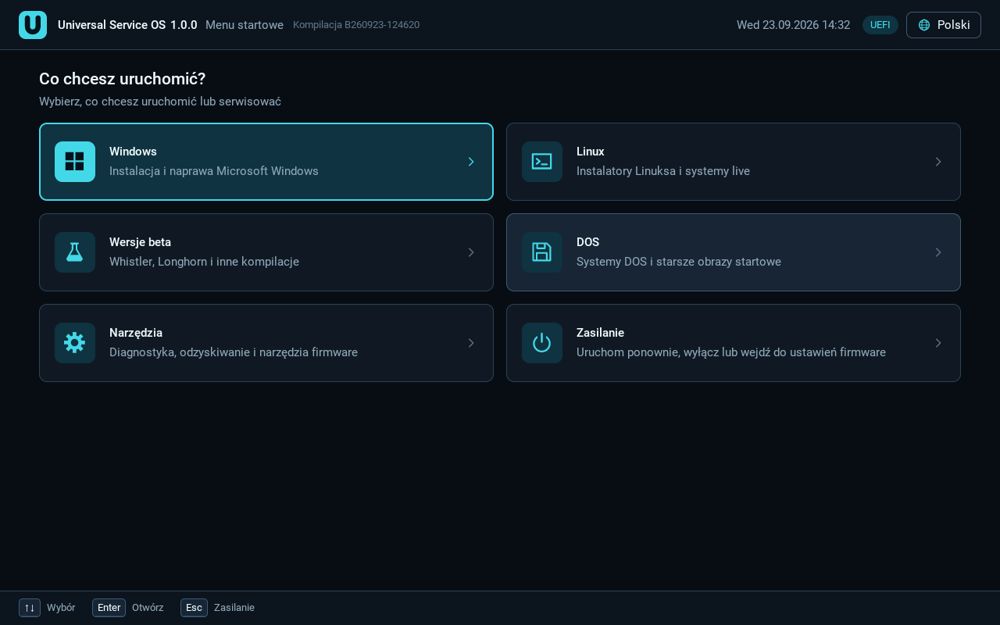
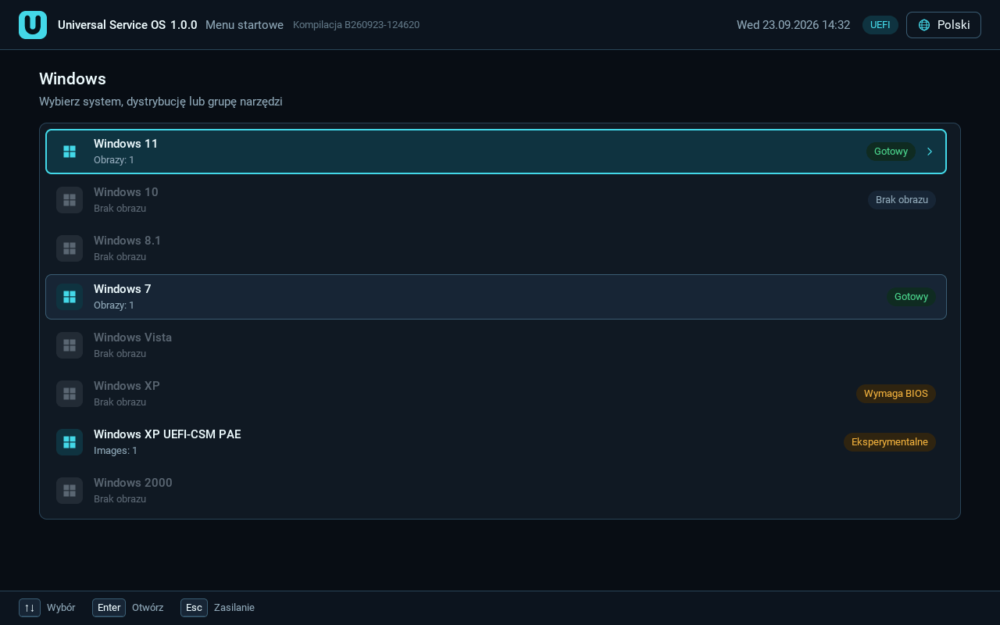
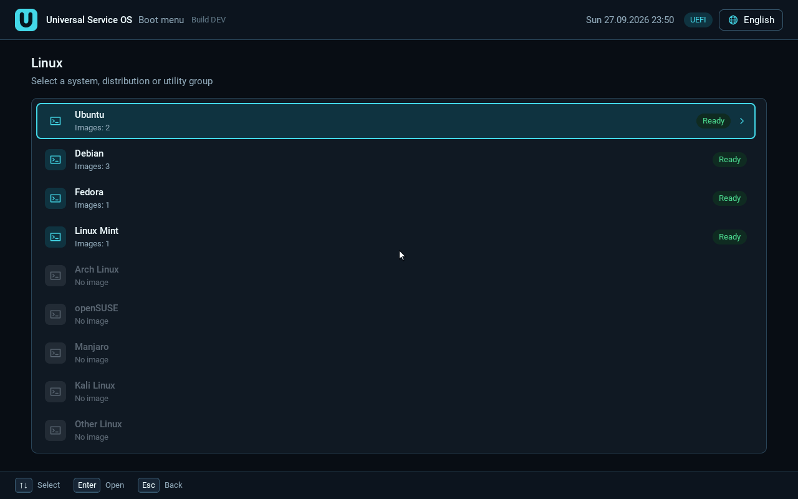
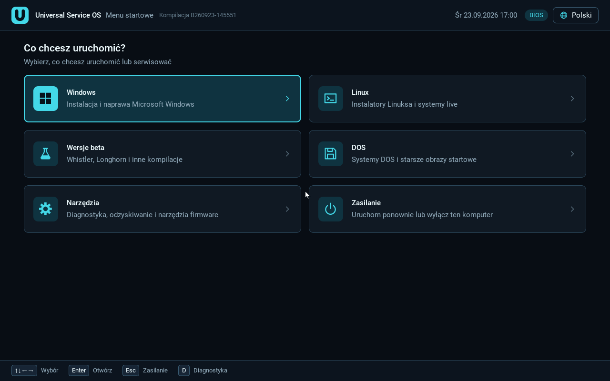
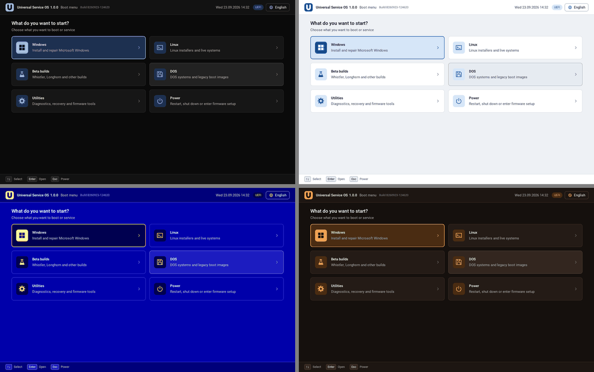
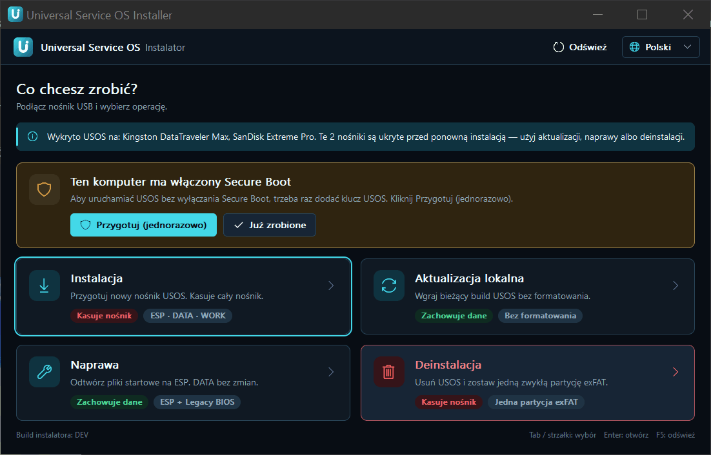
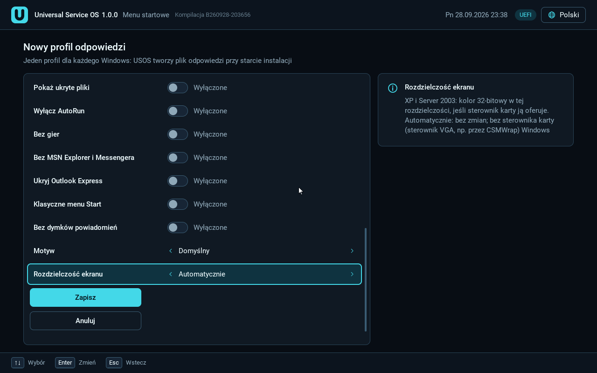

# Universal Service OS (USOS) 1.0.0

> To jest tłumaczenie. Wiążąca jest [angielska wersja README](../../README.md).

**Języki:** [English](../../README.md) ·
[Български](README.bg.md) ·
[Čeština](README.cs.md) ·
[Dansk](README.da.md) ·
[Deutsch](README.de.md) ·
[Ελληνικά](README.el.md) ·
[Español](README.es.md) ·
[Eesti](README.et.md) ·
[Suomi](README.fi.md) ·
[Français](README.fr.md) ·
[Hrvatski](README.hr.md) ·
[Magyar](README.hu.md) ·
[Italiano](README.it.md) ·
[Lietuvių](README.lt.md) ·
[Latviešu](README.lv.md) ·
[Norsk bokmål](README.nb.md) ·
[Nederlands](README.nl.md) ·
Polski ·
[Português (Brasil)](README.pt-BR.md) ·
[Română](README.ro.md) ·
[Русский](README.ru.md) ·
[Slovenčina](README.sk.md) ·
[Slovenščina](README.sl.md) ·
[Srpski (latinica)](README.sr-Latn.md) ·
[Svenska](README.sv.md) ·
[Türkçe](README.tr.md) ·
[Українська](README.uk.md)

## Spis treści

1. [Czym jest USOS](#what-usos-is)
2. [Możliwości](#features)
3. [Obsługiwane systemy i tryby firmware](#supported-systems)
4. [Szybki start](#quick-start)
5. [Układ folderów na DATA](#data-layout)
6. [Secure Boot](#secure-boot)
7. [Profile odpowiedzi](#answer-profiles)
8. [Znane problemy](#known-issues)
9. [Budowanie ze źródeł](#building)
10. [Licencja](#licence)
11. [Wsparcie](#support)
12. [Dokumentacja](#documentation)

<a id="what-usos-is"></a>
## 1. Czym jest USOS

USOS to jeden pendrive, z którego zainstalujesz i uruchomisz systemy od
MS-DOS po Windows 11 i Linuksa, na komputerach z BIOS-em i z UEFI, także
z włączonym Secure Boot. Własne obrazy ISO kopiujesz na pendrive jak zwykłe
pliki, a USOS daje jedno menu, jawny i chroniony wybór dysku docelowego oraz
sterowniki i poprawki, bez których stare systemy nie ruszą na nowym
sprzęcie. Pendrive przygotowuje się w Windows programem
`USOS-Installer-1.0.0.exe`. USOS nie zawiera obrazów Windows, kluczy
produktu ani niczego, co omija aktywację.



<a id="features"></a>
## 2. Możliwości

- **Jedno menu dla BIOS i UEFI.** Ten sam pendrive startuje w trybie Legacy
  BIOS i w UEFI (x64), z tym samym katalogiem. Menu UEFI obsługuje
  klawiaturę, mysz, ekran dotykowy i pady USB.
- **Obrazy zostają plikami.** ISO, WIM, IMG, VHD, VHDX i EFI są czytane
  wprost z partycji NTFS DATA: nic się nie rozpakowuje i po skopiowaniu nie
  trzeba niczego uruchamiać.
- **Chroniony dysk docelowy.** Dysk zawsze wybierasz i potwierdzasz sam;
  pendrive USOS nigdy nie jest proponowany jako cel.
- **Secure Boot** przez shim 16.1 (podpisany przez Microsoft) i klucz USOS
  (MOK), dodawany raz na każdym komputerze.
- **Stare Windows na nowym sprzęcie.** Windows XP z pakietem sterowników
  i PAE w UEFI z CSM; XP i Vista w UEFI bez CSM przez CSMWrap
  (eksperymentalnie); Windows 7 x64 bez CSM przez UefiSeven z dyspozytorem
  kierującym VGA na kartę graficzną; integracja sterowników USB 3 i NVMe dla
  Windows 7.
- **Profile odpowiedzi** do nienadzorowanych instalacji Windows i Linuksa,
  edytowane w menu UEFI, także klawiaturą ekranową.
- **Obrazy ISO Linuksa z DATA** (Ubuntu, Mint, Fedora, Debian,
  SystemRescue, GParted, Clonezilla i inne) w UEFI z Secure Boot i bez niego
  oraz w BIOS.
- **Narzędzia:** wbudowany FreeDOS z menedżerem plików i panel Hardware &
  SMART (BIOS), powłoka UEFI z EDK2 (UEFI), własne narzędzia startowe
  w `Utilities`, własne sterowniki UEFI i foldery ze sterownikami INF dla
  Windows.
- **Instalator z czterema trybami:** Instalacja, Aktualizacja lokalna
  (**Aktualizuj USOS**, zachowuje obrazy i Twoje pliki), Naprawa (**Napraw
  ESP**) i Deinstalacja.
- **27 języków** (wzorcem jest angielski; pozostałe, poza polskim, są
  oznaczone jako w części lub w całości tłumaczone maszynowo), motywy
  z edytorem w menu, obsługa dotyku i pada na ROG Ally.

| | |
|---|---|
|  |  |
| Systemy Windows z odznakami stanu | Obrazy ISO Linuksa z DATA |
|  |  |
| Menu w trybie Legacy BIOS | Motywy: Dark, Light, Retro, Sunset |

<a id="supported-systems"></a>
## 3. Obsługiwane systemy i tryby firmware

**HW** = sprawdzone na prawdziwym sprzęcie, **VM** = sprawdzone tylko
w QEMU/VirtualBox, **eksp.** = eksperymentalne (tak oznaczone w menu),
**nietestowane** = ścieżka istnieje, ale nie ma zapisanego przebiegu,
**—** = nieobsługiwane (menu podaje powód). Komputery testowe: **X470**
(ASRock X470, Ryzen 7 5700X, Radeon RX 560, UEFI), **MS-7100** (MSI,
Socket 939, Athlon 64 X2, BIOS), **Ally** (ASUS ROG Ally RC71L, UEFI
z Secure Boot).

| System | BIOS (Legacy) | UEFI + CSM | UEFI bez CSM (CSMWrap) | Secure Boot włączony |
|---|---|---|---|---|
| Samo menu USOS | HW | HW | HW | HW (X470, Ally) |
| MS-DOS 6.22, Windows 3.1/3.11 | HW (Windows 3.1 w trybie standardowym, MS-7100) | — | — | — |
| Windows 98 SE | VM; HW częściowo (MS-7100: Setup do przygotowania pierwszego startu, pulpit niepotwierdzony) | — | — | — |
| Windows 2000 SP4 | HW (MS-7100) | eksp., VM (do kopiowania plików) | eksp., VM (CSMWrap) | — |
| Windows XP x86 SP3 | VM (bez pakietu sterowników, bez PAE) | HW (X470: pakiet sterowników, PAE, 31,9 GB) | eksp., HW (X470, CSMWrap) | — |
| Windows XP x64 SP2 | nietestowane | eksp., VM (do GUI Setup); X470: STOP 0xA5 | eksp., VM (CSMWrap) | — |
| Windows Server 2003 R2 SP2 x86 | nietestowane | eksp., VM (do GUI Setup); X470 nietestowany z 1.0 | eksp., VM (CSMWrap) | — |
| Windows Vista SP2 x64 | HW (MS-7100) | HW (X470) | eksp., HW (X470, CSMWrap, legacy MBR) | — |
| Windows 7 SP1 x64 | HW (MS-7100) | VM (pełna instalacja) | HW (X470, UefiSeven + dyspozytor) | — |
| Windows 8 / 8.1 | nietestowane | nietestowane | nietestowane | nietestowane |
| Windows 10 | HW (x86, MS-7100) | HW (x64, X470) | natywne UEFI, ta sama ścieżka co z CSM | VM (do startu loadera Windows) |
| Windows 11 | nietestowane | HW (zgłoszenie użytkownika) | natywne UEFI, ta sama ścieżka co z CSM | VM (do startu loadera Windows) |
| Windows Server 2008 - 2025 | eksp., nigdy nie uruchomione | eksp., nigdy nie uruchomione | eksp., nigdy nie uruchomione | 2008/2008 R2: —; 2012+: nietestowane |
| ISO Linuksa (Ubuntu, Mint, Fedora, Debian, GParted, Clonezilla) | VM; HW Mint live (MS-7100) | HW (X470: Mint, Fedora, Debian netinst, Clonezilla, GParted) | jak z CSM | HW Fedora, Mint (X470); reszta VM |
| SystemRescue | VM | HW (X470) | jak z CSM | — (brak podpisanego programu startowego) |
| FreeDOS, Hardware & SMART (wbudowane) | VM (FreeDOS); HW (Hardware & SMART) | — | — | — |
| MemTest86+ (ISO i586, dostarczasz sam) | HW | wersja `.efi` z `Utilities` (nietestowane) | jak z CSM | tylko podpisany `.efi` |
| Powłoka UEFI (wbudowana) | — | VM | VM | VM (startuje, ale nie uruchamia narzędzi) |

Tryb UEFI z CSM lub bez ma znaczenie tylko dla ścieżek legacy (2000, XP,
2003, Vista, 7); wszystkie pozostałe pozycje UEFI działają w obu trybach tym
samym kodem. Windows XP, Vista i 7 oraz każda ścieżka przez CSMWrap wymagają
wyłączonego Secure Boot. Pełna tabela z uwagami i wynikami sprzętowymi dla
poszczególnych buildów:
[przewodnik, rozdział 5](../USER-GUIDE.pl.md#5-co-działa-w-którym-trybie-firmware)
i [informacje o wydaniu](../release-notes-1.0.md#supported-systems) (po
angielsku).

<a id="quick-start"></a>
## 4. Szybki start

Pliki wydania:

| Plik | Do czego służy |
|---|---|
| `USOS-Installer-1.0.0.exe` | instalator; zawiera cały USOS |
| `USOS-1.0.0-WinPE-PE10-donor.zip` | dawca PE10, potrzebny dla Visty i oryginalnych ISO Windows 7 w UEFI |
| `USOS-1.0.0-XP-package-PL.zip`, `USOS-1.0.0-XP-package-EN.zip` | pakiet UEFI dla Windows XP x86 SP3; każdy pasuje do dokładnie jednego oryginalnego ISO (`pl_..._x14-80476.iso` / `en_..._x14-80428.iso`), instalowany dołączonym skryptem `install-xp-package.ps1` |
| `USOS-1.0.0-sources.zip` + `SOURCE-OFFER.txt` | źródła komponentów zewnętrznych i pisemna oferta udostępnienia źródeł |
| `USOS-1.0.0-buildkit.zip` | przypięte narzędzia i wejścia buildu do odtworzenia wydania offline |
| `LICENSES/`, `THIRD-PARTY-NOTICES.txt` | teksty licencji i informacje o komponentach |
| `SHA256SUMS` | SHA-256 każdego pliku |

Pobrany plik sprawdzisz poleceniem
`certutil -hashfile USOS-Installer-1.0.0.exe SHA256` (albo `Get-FileHash`
w PowerShell), porównując wynik z wierszem w `SHA256SUMS`.



1. Przygotuj pendrive o pojemności **co najmniej 32 GiB** (w praktyce
   64 GB; pendrive sprzedawany jako „32 GB” jest zwykle za mały).
   **Wszystko, co na nim jest, zostanie skasowane.**
2. Na komputerze z Windows uruchom `USOS-Installer-1.0.0.exe` (poprosi
   o uprawnienia administratora), wybierz **Instalacja**, wskaż pendrive,
   przepisz tekst potwierdzenia i kliknij **ROZPOCZNIJ KASOWANIE
   I INSTALACJĘ**.
3. Skopiuj swoje obrazy ISO na partycję DATA, do folderu `Images`
   odpowiedniego systemu, np. `Systems\Windows\Windows 11\Images\`.
4. Opcjonalnie: dla Visty lub oryginalnego Windows 7 w UEFI skopiuj folder
   `Programs` z archiwum dawcy PE10 do katalogu głównego DATA i uruchom
   **Aktualizuj USOS**; dla XP w UEFI uruchom jako administrator
   `install-xp-package.ps1` z pakietu XP pasującego do Twojego ISO (na
   pendrivie może być tylko jeden pakiet naraz).
5. Uruchom docelowy komputer z pendrive'a (BIOS albo UEFI). Przy włączonym
   Secure Boot dodaj raz klucz USOS ([Secure Boot](#secure-boot)). Wybierz
   system i obraz, ewentualnie profil odpowiedzi, potwierdź dysk docelowy
   i przejdź przez instalator systemu.

Instrukcja krok po kroku dla każdego ekranu jest w przewodniku użytkownika:
[Polski](../USER-GUIDE.pl.md), [English](../USER-GUIDE.en.md).

<a id="data-layout"></a>
## 5. Układ folderów na DATA

Instalator zakłada na pendrivie trzy partycje: `USOS_ESP` (FAT32, 1 GiB:
pliki startowe, klucz, ustawienia, logi, profile), `USOS_DATA` (NTFS: Twoje
pliki) i `USOS_WORK` (NTFS, miejsce robocze dla niektórych instalatorów
Windows). Wszystkie foldery na DATA powstają same:

```
USOS_DATA\
├─ Systems\
│  ├─ Windows\<wersja>\     Images\  Unattended\   (od Windows 3.1 do 11, Server 2003-2025)
│  ├─ Linux\<dystrybucja>\  Images\  Unattended\   (Other Linux\ dla nieznanych ISO)
│  ├─ Betas\
│  └─ DOS\<odmiana>\        Images\
├─ Utilities\
│  ├─ FreeDOS\Programs\     programy DOS dla wbudowanego FreeDOS
│  ├─ UEFI Shell\Tools\     narzędzia EFI dla powłoki UEFI
│  └─ <Twoje narzędzie>\Images\   np. MemTest86\Images\memtest86.efi
├─ Drivers\
│  ├─ UEFI\<nazwa>\         sterowniki .efi ładowane przez menu USOS
│  └─ <wersja Windows>\     Storage\  USB\  Other\  (pakiety INF)
├─ Themes\<nazwa>\theme.ini własne motywy (menu UEFI)
└─ Programs\
   └─ USOS\                 zarządzany przez USOS (dawca PE10), nie ruszać
```

Po dodaniu pliku `icon.png` albo nowego folderu z narzędziem uruchom
**Aktualizuj USOS**. Pełne drzewo:
[przewodnik, rozdział 4](../USER-GUIDE.pl.md#4-układ-folderów-na-data).

<a id="secure-boot"></a>
## 6. Secure Boot

Przy włączonym Secure Boot USOS startuje przez **shim 16.1** (build Fedory,
podpisany przez Microsoft UEFI CA) i MokManagera. Sam USOS i jego składniki
są podpisane **kluczem USOS**, który dodaje się **raz na każdym
komputerze**:

- **Najprościej:** wyłącz Secure Boot, uruchom pendrive, na ekranie głównym
  wybierz **Dodaj** i potwierdź **Tak, zapisz klucz**, a potem z powrotem
  włącz Secure Boot. Działa to także w trybie Setup Mode (sprawdzone na
  X470).
- **Bez wyłączania Secure Boot:** na ekranie „Verification failed” wybierz
  w MokManagerze **Enroll key from disk** -> `USOS_ESP` -> `USOS-KEY.cer`
  (sprawdzone na ROG Ally). Przycisk **Przygotuj (jednorazowo)** na karcie
  Secure Boot w instalatorze sprawia, że MokManager czeka, zamiast odliczać
  czas.

Reset NVRAM usuwa klucz; wtedy trzeba go dodać ponownie. XP, Vista, 7,
każda ścieżka przez CSMWrap, SystemRescue i narzędzia uruchamiane z powłoki
UEFI wymagają wyłączonego Secure Boot. Jądro nie jest jeszcze zablokowane
(punkt N6 roadmapy), więc dodanie klucza USOS oznacza zaufanie wszystkiemu,
co nim podpisano. Szczegóły:
[przewodnik, rozdział 6](../USER-GUIDE.pl.md#6-secure-boot-i-klucz-usos-mok),
[secure-boot-usos.md](../secure-boot-usos.md).

<a id="answer-profiles"></a>
## 7. Profile odpowiedzi

Jeden mały profil (konta, nazwa komputera, język, strefa czasowa,
opcjonalne dodatki) przy starcie instalacji zamienia się w `WINNT.SIF`
(2000/XP/2003), `autounattend.xml` (od Visty do 11, Server) albo
w autoinstall Ubuntu, preseed Debiana lub kickstart Fedory. Profile tworzy
się w menu UEFI (**Instalacja nienadzorowana** -> **+ Dodaj nowy profil**),
a zapisują się na ESP.



- Dysk docelowy **zawsze wybierasz ręcznie**; profil nigdy nie wybiera ani
  nie kasuje dysku.
- Klucz produktu zapisuje się tylko wtedy, gdy zaznaczysz „Zapamiętaj klucz
  na pendrivie”; inaczej jest pamiętany tylko do restartu. **USOS nie
  zawiera żadnych kluczy** i nie omija aktywacji ani strony z kluczem
  produktu.
- Hasła i zapamiętane klucze leżą na pendrivie jawnym tekstem (menu nigdy
  nie pokazuje ich na listach ani w logach). Profile dla Linuksa działają
  tylko w UEFI.

Szczegóły: [przewodnik, rozdział 7](../USER-GUIDE.pl.md#7-profile-odpowiedzi-i-dodatki),
[answer-profiles.md](../answer-profiles.md).

<a id="known-issues"></a>
## 8. Znane problemy

- **Vista na płytach tylko z USB 3 (X470):** w zainstalowanym systemie nie
  widać pendrive'ów, a Vista zostaje w trybie testowym (backport USB 3 jest
  podpisany testowo). Oba problemy omija karta PCIe z kontrolerem Renesas
  uPD72020x.
- **Ścieżki przez CSMWrap:** wymagają karty graficznej z VBIOS-em legacy
  (inaczej ekran zostaje czarny), zabierają jeden wątek CPU, potrzebują
  dysku docelowego MBR (jest kasowany) i wyłączonego Secure Boot.
- **Server 2003 x86 / XP x64:** STOP 0xA5 (ACPI) na X470 i brak wejścia USB
  na płytach tylko z xHCI.
- **Windows 2000** nie działa na płytach tylko z AHCI (brak sterownika AHCI
  dla NT 5.0); **XP** nie obsługuje NVMe, a w trybie BIOS nie dostaje
  pakietu sterowników ani PAE.
- **Secure Boot:** SystemRescue jest zablokowany (brak podpisanego programu
  startowego); powłoka UEFI nie uruchamia narzędzi; po aktualizacji DBX
  (BlackLotus) starsze nośniki Windows nie startują.
- **Linux:** instalator Ubuntu Server z góry wybiera największy dysk, a to
  może być pendrive USOS; zawsze sprawdź dysk docelowy.
- **Firmware AMI** pokazuje każdą partycję pendrive'a jako osobną pozycję
  startową.
- Pomocniczy mikro-Linux wymaga procesora x86-64 i co najmniej 256 MiB RAM.

Pełną listę z obejściami oraz uczciwą listę tego, czego **jeszcze nie
sprawdzono** na sprzęcie (m.in. Windows Server 2008-2025, Windows 8/8.1,
Windows 10/11 z Secure Boot na sprzęcie, oryginalne ISO Windows 7 SP1 przez
dawcę PE10), znajdziesz w
[informacjach o wydaniu](../release-notes-1.0.md#known-issues) (po
angielsku) i w [przewodniku, rozdziały 9 i 10](../USER-GUIDE.pl.md#9-znane-problemy-i-obejścia).

<a id="building"></a>
## 9. Budowanie ze źródeł

Build działa w Windows. Pełna instrukcja: [BUILDING.md](../BUILDING.md) (po
angielsku).

- `build.bat` buduje całe wydanie (program EFI, mikro-Linux, rdzeń BIOS,
  payload i `installer\USOS Installer.exe`) z jednym identyfikatorem buildu
  (`BYYMMDD-HHMMSS-XXXXXXXX`). Używany jest przenośny Zig z `tools/zig`; Go
  i Python muszą być w `PATH`.
- `tools/tests/run.ps1` uruchamia testy automatyczne, np.
  `powershell.exe -NoProfile -ExecutionPolicy Bypass -File tools/tests/run.ps1 -Suite all`.
- `powershell -ExecutionPolicy Bypass -File tools\release\make_release.ps1`
  tworzy pliki wydania w `zig-out\release-1.0\`.
- **Build offline:** rozpakuj `USOS-1.0.0-buildkit.zip`, ustaw zmienną
  `USOS_BUILDKIT` na rozpakowany folder `USOS-1.0.0-buildkit` i uruchom
  `build.bat`; zestaw jest sprawdzany z manifestem, a pobieranie z sieci jest
  wyłączone.
- **Klucz podpisu:** klucz Secure Boot (MOK) leży **poza repozytorium**,
  w `%APPDATA%\USOS\signing\` (zmienna `USOS_SIGNING_DIR` zmienia to
  miejsce). Bez niego build jest **niepodpisany** i startuje tylko przy
  wyłączonym Secure Boot. Nigdy nie commituj ani nie udostępniaj klucza.

Obrazy ISO Windows, sterowniki i inne nośniki zewnętrzne nigdy nie trafiają
do repozytorium.

<a id="licence"></a>
## 10. Licencja

- Własny kod USOS jest objęty licencją **GNU General Public License
  w wersji 3 lub nowszej** (GPL-3.0-or-later): zobacz [LICENSE](../../LICENSE)
  i [NOTICE](../../NOTICE). Copyright (C) 2026 Maksymilian and the USOS Authors.
- Komponenty zewnętrzne zachowują własne licencje. To osobne programy,
  zebrane razem na pendrivie; zobacz `THIRD-PARTY-NOTICES.txt` i `LICENSES/`
  w wydaniu oraz [LICENSES-AUDIT.md](../LICENSES-AUDIT.md).
- Pliki Microsoftu w wydaniu (pliki aktualizacji i sterowników, pliki
  w pakietach XP, dawca WinPE) są zachowane w celach archiwalnych,
  rozpowszechniane na własne ryzyko osoby prowadzącej projekt, nie są objęte żadną
  licencją USOS i zostaną usunięte na prośbę właściciela praw.
- Wkład w projekt jest przyjmowany na zasadach z
  [CONTRIBUTING.md](../../CONTRIBUTING.md) (proste udzielenie licencji przez
  autora wkładu).

Windows, MS-DOS i powiązane nazwy są znakami towarowymi Microsoftu. USOS nie
jest powiązany z Microsoftem.

<a id="support"></a>
## 11. Wsparcie

- Pytania i zgłoszenia błędów: GitHub Issues. Dołącz logi opisane
  w [przewodniku, rozdział 11](../USER-GUIDE.pl.md#11-rozwiązywanie-problemów-i-logi)
  i sprawdź wcześniej, czy nie ma w nich haseł ani kluczy.
- Płatna pomoc przy wdrożeniu dla firm jest dostępna na życzenie; na razie
  kontakt przez GitHub Issues.
- Wsparcie finansowe projektu: przez `.github/FUNDING.yml`, gdy zostanie
  uzupełniony.

<a id="documentation"></a>
## 12. Dokumentacja

- Przewodnik użytkownika: [Polski](../USER-GUIDE.pl.md), [English](../USER-GUIDE.en.md)
- [Informacje o wydaniu 1.0](../release-notes-1.0.md) (po angielsku)
- [Jak działa USOS](../HOW-IT-WORKS.md)
- [Budowanie](../BUILDING.md)
- [Audyt licencji](../LICENSES-AUDIT.md)
- [Plan testu wydania 1.0](../RELEASE-TEST-1.0.md)
- [Roadmapa](../ROADMAP.md) i [wyniki testów](../../TESTING.md)
